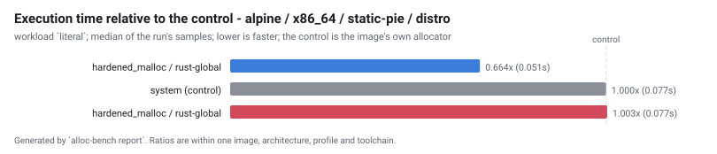
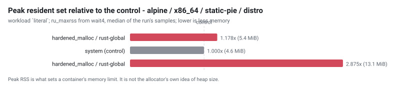
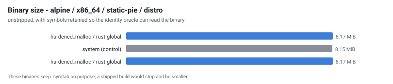

# Allocator benchmark - run `20260902-074405`

Generated by `alloc-bench report`.  Do not edit: it is overwritten from the dataset in `results/`.

## What this run does not establish

Read this before the tables. It is not a disclaimer; it is the list of questions these numbers cannot answer.

| | |
| --- | --- |
| **one machine, one day** | `Intel(R) Xeon(R) Processor @ 2.80GHz`, 4 × `x86_64`, 16075 MiB RAM, kernel `Linux 6.18.44-fc-v22`. Absolute timings here do not transfer to other hardware. Ratios within a group are the transferable part, and even those are measured, not guaranteed. |
| **cells that could not exist** | 0 configuration(s) are unsupported, each with a recorded technical reason. They are listed below rather than dropped. |
| **cells that failed** | 0 configuration(s) were attempted and did not produce a usable result. Also listed below. |
| **noise** | 3 cell(s) measured a relative MAD above the 5% threshold. Differences smaller than that cell's own spread are not attributable to the allocator. |
| **what an allocator is good at generally** | this measures one application (ripgrep) on one corpus shape. ripgrep is not allocation-bound; an allocation-heavy service would rank differently, and nothing here says otherwise. |
| **security** | hardened_malloc trades performance for memory-safety mitigations. A slower row for it is the expected cost of what it does, not a defect, and this project makes no claim about whether those mitigations work. |

## Conditions

| | |
| --- | --- |
| run id | `20260902-074405` |
| started | 2026-09-02T07:44:05Z |
| suites | hardening-variants |
| repository commit | `3ce29e999b9d02093ca68aec67806df636d80b5d` |
| corpus seed | `20260901` |
| container runtime | docker 29.3.1 |
| primary workload | `literal` |

### Exactly what produced these numbers

| component | ref | commit |
| --- | --- | --- |
| `hardened_malloc` | release `14` | [`1d7fc7ffe0f8`](https://github.com/GrapheneOS/hardened_malloc/commit/1d7fc7ffe0f8068a32ab2ba33df7515e7bad3f5f) |
| `jemalloc` | release `5.3.1` | [`81034ce1f137`](https://github.com/jemalloc/jemalloc/commit/81034ce1f1373e37dc865038e1bc8eeecf559ce8) |
| `mesh` | branch `master` | [`2987f883b869`](https://github.com/plasma-umass/mesh/commit/2987f883b8695c07a80dc40da67c61f524460dfd) |
| `mimalloc` | release `v3.5.0` | [`18b08671c930`](https://github.com/microsoft/mimalloc/commit/18b08671c9302247bfb682286e6bf3cc1773f801) |
| `ripgrep` | release `15.2.0` | [`e89fff89ac9a`](https://github.com/BurntSushi/ripgrep/commit/e89fff89ac9af12e8d4ce9d5fd07beb408ca730f) |
| `rpmalloc` | release `2.0.1` | [`beef233c176b`](https://github.com/mjansson/rpmalloc/commit/beef233c176b235587c0145f765e4316e5ca60d1) |
| `snmalloc` | release `0.7.5` | [`526c55bdffa1`](https://github.com/microsoft/snmalloc/commit/526c55bdffa17aae20a9a3d24fe68a7a3b8d9894) |
| `tcmalloc` | branch `master` | [`897c9eaf5d31`](https://github.com/google/tcmalloc/commit/897c9eaf5d31a94ca9983782de5d6c3c347e609e) |

## Rankings

Ordered by median execution time on `literal`, fastest first. `rel` is the ratio against the control in the SAME image, architecture, profile and toolchain - no ratio crosses a group. `MAD` is the relative median absolute deviation of that cell's own samples: **a difference smaller than the MAD is not a result**.

Composite, where shown: `composite = 0.60 x (time / baseline_time) + 0.30 x (peak_rss / baseline_peak_rss) + 0.10 x (binary_bytes / baseline_binary_bytes); lower is better, 1.000 is the control`.

### alpine / x86_64 / static-pie / distro

| # | allocator | mechanism | time (s) | rel | MAD | peak RSS (MiB) | rel | size (MiB) | startup (s) | composite |
| --- | --- | --- | --- | --- | --- | --- | --- | --- | --- | --- |
| 1 | hardened_malloc `light` | `rust-global` | 0.051 | 0.664 | 4.0% | 5.379 | 1.178 | 8.17 | 0.003 | 0.852 |
| 2 | system *(control)* | `baseline` | 0.077 | 1.000 | 0.9% | 4.566 | 1.000 | 8.15 | 0.002 | 1.000 |
| 3 | hardened_malloc | `rust-global` | 0.077 | 1.003 | 2.1% | 13.129 | 2.875 | 8.17 | 0.004 | 1.564 |

> **Fastest: hardened_malloc (rust-global).** hardened_malloc is 50.5% faster than the next row, which is outside the run's spread of 4.0%

## Every workload

The ranking above uses one workload. These are all of them, as median seconds, so a reader can see whether the ordering holds or whether it is an artefact of one shape of work.

| cell | files | json | literal | literal-j1 | nomatch | regex | startup |
| --- | --- | --- | --- | --- | --- | --- | --- |
| `alpine-x86_64-hardened_malloc-rust-global-static-pie-distro` | 0.071 | 0.070 | 0.077 | 0.126 | 0.054 | 0.078 | 0.004 |
| `alpine-x86_64-hardened_malloc-rust-global-static-pie-distro-light` | 0.050 | 0.047 | 0.051 | 0.116 | 0.033 | 0.055 | 0.003 |
| `alpine-x86_64-system-baseline-static-pie-distro` | 0.065 | 0.060 | 0.077 | 0.110 | 0.041 | 0.064 | 0.002 |

## Address-space randomisation, observed

Read from `/proc/<pid>/maps` while each binary was running, not inferred from the ELF type. A static non-PIE executable is loaded at a fixed address; a static PIE is not.

| cell | profile | link kind | distinct load addresses | randomised |
| --- | --- | --- | --- | --- |
| `alpine-x86_64-hardened_malloc-rust-global-static-pie-distro` | static-pie | static-pie | 6 of 6 | true |
| `alpine-x86_64-hardened_malloc-rust-global-static-pie-distro-light` | static-pie | static-pie | 6 of 6 | true |
| `alpine-x86_64-system-baseline-static-pie-distro` | static-pie | static-pie | 6 of 6 | true |

## Configurations that could not exist

None in this run.

## Configurations that failed

None in this run.

## Validation

`alloc-bench validate` checks the dataset before this report is written. An `ERROR` means the ranking above must not be trusted; the exit status reflects it.

| severity | check | cell | message |
| --- | --- | --- | --- |
| warn | `noisy` | `alpine-x86_64-hardened_malloc-rust-global-static-pie-distro` | workload files has a relative MAD of 5.3%, above the 5% threshold; differences smaller than that cannot be attributed to the allocator on this host |
| warn | `noisy` | `alpine-x86_64-hardened_malloc-rust-global-static-pie-distro` | workload startup has a relative MAD of 10.9%, above the 5% threshold; differences smaller than that cannot be attributed to the allocator on this host |
| warn | `noisy` | `alpine-x86_64-system-baseline-static-pie-distro` | workload json has a relative MAD of 5.3%, above the 5% threshold; differences smaller than that cannot be attributed to the allocator on this host |

---

3 cell(s) planned, 3 produced a usable result, 0 unsupported, 0 failed.

Raw samples, build metadata, identity evidence and correctness output for every cell are in `results/` and `cells/` beside this file.  Every number above is derived from them; none was typed in.
