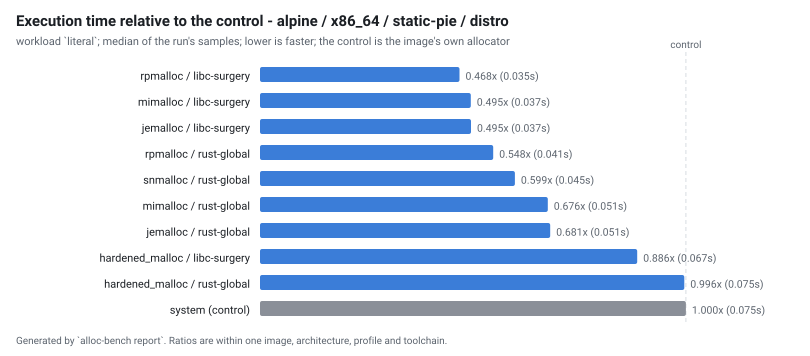
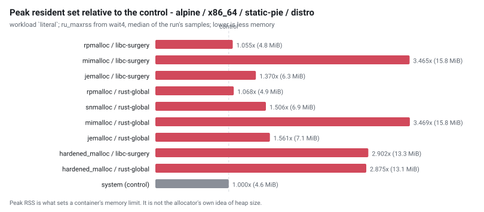
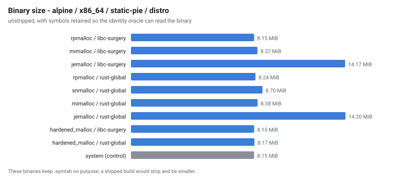

# Allocator benchmark - run `20260902-021113`

Generated by `alloc-bench report`.  Do not edit: it is overwritten from the dataset in `results/`.

## What this run does not establish

Read this before the tables. It is not a disclaimer; it is the list of questions these numbers cannot answer.

| | |
| --- | --- |
| **one machine, one day** | `Intel(R) Xeon(R) Processor @ 2.80GHz`, 4 × `x86_64`, 16075 MiB RAM, kernel `Linux 6.18.44-fc-v22`. Absolute timings here do not transfer to other hardware. Ratios within a group are the transferable part, and even those are measured, not guaranteed. |
| **cells that could not exist** | 0 configuration(s) are unsupported, each with a recorded technical reason. They are listed below rather than dropped. |
| **cells that failed** | 6 configuration(s) were attempted and did not produce a usable result. Also listed below. |
| **noise** | 16 cell(s) measured a relative MAD above the 5% threshold. Differences smaller than that cell's own spread are not attributable to the allocator. |
| **what an allocator is good at generally** | this measures one application (ripgrep) on one corpus shape. ripgrep is not allocation-bound; an allocation-heavy service would rank differently, and nothing here says otherwise. |
| **security** | hardened_malloc trades performance for memory-safety mitigations. A slower row for it is the expected cost of what it does, not a defect, and this project makes no claim about whether those mitigations work. |

## Conditions

| | |
| --- | --- |
| run id | `20260902-021113` |
| started | 2026-09-02T02:11:13Z |
| suites | mechanisms |
| repository commit | `31476973fae90d40d3a7e562c41b855387a6b986` |
| corpus seed | `20260901` |
| container runtime | docker 29.3.1 |
| primary workload | `literal` |

### Exactly what produced these numbers

| component | ref | commit |
| --- | --- | --- |
| `hardened_malloc` | release `14` | [`1d7fc7ffe0f8`](https://github.com/GrapheneOS/hardened_malloc/commit/1d7fc7ffe0f8068a32ab2ba33df7515e7bad3f5f) |
| `jemalloc` | release `5.3.1` | [`81034ce1f137`](https://github.com/jemalloc/jemalloc/commit/81034ce1f1373e37dc865038e1bc8eeecf559ce8) |
| `mesh` | branch `master` | [`2987f883b869`](https://github.com/plasma-umass/mesh/commit/2987f883b8695c07a80dc40da67c61f524460dfd) |
| `mimalloc` | release `v3.5.0` | [`18b08671c930`](https://github.com/microsoft/mimalloc/commit/18b08671c9302247bfb682286e6bf3cc1773f801) |
| `ripgrep` | release `15.2.0` | [`e89fff89ac9a`](https://github.com/BurntSushi/ripgrep/commit/e89fff89ac9af12e8d4ce9d5fd07beb408ca730f) |
| `rpmalloc` | release `2.0.1` | [`beef233c176b`](https://github.com/mjansson/rpmalloc/commit/beef233c176b235587c0145f765e4316e5ca60d1) |
| `snmalloc` | release `0.7.5` | [`526c55bdffa1`](https://github.com/microsoft/snmalloc/commit/526c55bdffa17aae20a9a3d24fe68a7a3b8d9894) |
| `tcmalloc` | branch `master` | [`897c9eaf5d31`](https://github.com/google/tcmalloc/commit/897c9eaf5d31a94ca9983782de5d6c3c347e609e) |

## Rankings

Ordered by median execution time on `literal`, fastest first. `rel` is the ratio against the control in the SAME image, architecture, profile and toolchain - no ratio crosses a group. `MAD` is the relative median absolute deviation of that cell's own samples: **a difference smaller than the MAD is not a result**.

Composite, where shown: `composite = 0.60 x (time / baseline_time) + 0.30 x (peak_rss / baseline_peak_rss) + 0.10 x (binary_bytes / baseline_binary_bytes); lower is better, 1.000 is the control`.

### alpine / x86_64 / static-pie / distro

| # | allocator | mechanism | time (s) | rel | MAD | peak RSS (MiB) | rel | size (MiB) | startup (s) | composite |
| --- | --- | --- | --- | --- | --- | --- | --- | --- | --- | --- |
| 1 | rpmalloc | `libc-surgery` | 0.035 | 0.468 | 4.2% | 4.816 | 1.055 | 8.15 | 0.002 | 0.697 |
| 2 | mimalloc | `libc-surgery` | 0.037 | 0.495 | 7.4% | 15.822 | 3.465 | 8.37 | 0.002 | 1.439 |
| 3 | jemalloc | `libc-surgery` | 0.037 | 0.495 | 3.4% | 6.254 | 1.370 | 14.17 | 0.002 | 0.882 |
| 4 | rpmalloc | `rust-global` | 0.041 | 0.548 | 3.4% | 4.879 | 1.068 | 8.24 | 0.002 | 0.750 |
| 5 | snmalloc | `rust-global` | 0.045 | 0.599 | 4.5% | 6.879 | 1.506 | 8.70 | 0.002 | 0.918 |
| 6 | mimalloc | `rust-global` | 0.051 | 0.676 | 6.3% | 15.840 | 3.469 | 8.38 | 0.003 | 1.549 |
| 7 | jemalloc | `rust-global` | 0.051 | 0.681 | 6.4% | 7.129 | 1.561 | 14.20 | 0.002 | 1.051 |
| 8 | hardened_malloc | `libc-surgery` | 0.067 | 0.886 | 3.8% | 13.254 | 2.902 | 8.15 | 0.004 | 1.502 |
| 9 | hardened_malloc | `rust-global` | 0.075 | 0.996 | 3.3% | 13.129 | 2.875 | 8.17 | 0.004 | 1.561 |
| 10 | system *(control)* | `baseline` | 0.075 | 1.000 | 2.7% | 4.566 | 1.000 | 8.15 | 0.003 | 1.000 |

>  **No winner is claimed here.** the lead of 5.6% is within this run's own spread (7.4% relative MAD), so the ordering between the top rows is not established here

## Every workload

The ranking above uses one workload. These are all of them, as median seconds, so a reader can see whether the ordering holds or whether it is an artefact of one shape of work.

| cell | files | json | literal | literal-j1 | nomatch | regex | startup |
| --- | --- | --- | --- | --- | --- | --- | --- |
| `alpine-x86_64-hardened_malloc-libc-surgery-static-pie-distro` | 0.059 | 0.064 | 0.067 | 0.126 | 0.050 | 0.069 | 0.004 |
| `alpine-x86_64-hardened_malloc-rust-global-static-pie-distro` | 0.069 | 0.070 | 0.075 | 0.126 | 0.052 | 0.074 | 0.004 |
| `alpine-x86_64-jemalloc-libc-surgery-static-pie-distro` | 0.042 | 0.044 | 0.037 | 0.109 | 0.028 | 0.045 | 0.002 |
| `alpine-x86_64-jemalloc-rust-global-static-pie-distro` | 0.044 | 0.045 | 0.051 | 0.111 | 0.030 | 0.050 | 0.002 |
| `alpine-x86_64-mimalloc-libc-surgery-static-pie-distro` | 0.036 | 0.037 | 0.037 | 0.106 | 0.024 | 0.039 | 0.002 |
| `alpine-x86_64-mimalloc-rust-global-static-pie-distro` | 0.047 | 0.044 | 0.051 | 0.116 | 0.031 | 0.054 | 0.003 |
| `alpine-x86_64-rpmalloc-libc-surgery-static-pie-distro` | 0.038 | 0.039 | 0.035 | 0.101 | 0.023 | 0.037 | 0.002 |
| `alpine-x86_64-rpmalloc-rust-global-static-pie-distro` | 0.045 | 0.042 | 0.041 | 0.116 | 0.030 | 0.051 | 0.002 |
| `alpine-x86_64-snmalloc-rust-global-static-pie-distro` | 0.043 | 0.042 | 0.045 | 0.106 | 0.028 | 0.047 | 0.002 |
| `alpine-x86_64-system-baseline-static-pie-distro` | 0.056 | 0.055 | 0.075 | 0.112 | 0.037 | 0.054 | 0.003 |

## Address-space randomisation, observed

Read from `/proc/<pid>/maps` while each binary was running, not inferred from the ELF type. A static non-PIE executable is loaded at a fixed address; a static PIE is not.

| cell | profile | link kind | distinct load addresses | randomised |
| --- | --- | --- | --- | --- |
| `alpine-x86_64-hardened_malloc-libc-surgery-static-pie-distro` | static-pie | static-pie | 6 of 6 | true |
| `alpine-x86_64-hardened_malloc-rust-global-static-pie-distro` | static-pie | static-pie | 6 of 6 | true |
| `alpine-x86_64-jemalloc-libc-surgery-static-pie-distro` | static-pie | static-pie | 6 of 6 | true |
| `alpine-x86_64-jemalloc-rust-global-static-pie-distro` | static-pie | static-pie | 6 of 6 | true |
| `alpine-x86_64-mimalloc-libc-surgery-static-pie-distro` | static-pie | static-pie | 6 of 6 | true |
| `alpine-x86_64-mimalloc-rust-global-static-pie-distro` | static-pie | static-pie | 6 of 6 | true |
| `alpine-x86_64-rpmalloc-libc-surgery-static-pie-distro` | static-pie | static-pie | 6 of 6 | true |
| `alpine-x86_64-rpmalloc-rust-global-static-pie-distro` | static-pie | static-pie | 6 of 6 | true |
| `alpine-x86_64-snmalloc-rust-global-static-pie-distro` | static-pie | static-pie | 6 of 6 | true |
| `alpine-x86_64-system-baseline-static-pie-distro` | static-pie | static-pie | 6 of 6 | true |

## Configurations that could not exist

None in this run.

## Configurations that failed

| cell | outcome | detail |
| --- | --- | --- |
| `alpine-x86_64-hardened_malloc-link-override-static-pie-distro` | `build_failed` | ripgrep build failed (rc=1); tail:           random.c:(.text+0x345): undefined reference to `__stack_chk_fail'           /usr/lib/gcc/x86_64-alpine-linux-musl/15.2.0/../../../../x86_64-alpine-linux-musl/bin/ld: /cache/alloc/hardened_malloc-1d7fc7ffe0f8068a32ab2ba33df7515e7bad3f5f-override-pic1-musl-x86_64-distro-default/lib/liballocbench.a(random.o): in function `get_random_u64':           random. |
| `alpine-x86_64-jemalloc-link-override-static-pie-distro` | `build_failed` | ripgrep build failed (rc=1); tail:           /usr/lib/gcc/x86_64-alpine-linux-musl/15.2.0/../../../../x86_64-alpine-linux-musl/bin/ld: /cache/src/jemalloc-81034ce1f1373e37dc865038e1bc8eeecf559ce8/include/jemalloc/internal/mutex.h:282:(.text+0x6ea): undefined reference to `pthread_mutex_unlock'           /usr/lib/gcc/x86_64-alpine-linux-musl/15.2.0/../../../../x86_64-alpine-linux-musl/bin/ld: /cach |
| `alpine-x86_64-mimalloc-link-override-static-pie-distro` | `build_failed` | ripgrep build failed (rc=1); tail:           /usr/lib/gcc/x86_64-alpine-linux-musl/15.2.0/../../../../x86_64-alpine-linux-musl/bin/ld: /cache/alloc/mimalloc-18b08671c9302247bfb682286e6bf3cc1773f801-override-pic1-musl-x86_64-distro-default/lib/liballocbench.a(os.c.o): in function `_mi_os_alloc_aligned':           os.c:(.text+0x1793): undefined reference to `__stack_chk_fail'           /usr/lib/gcc/ |
| `alpine-x86_64-rpmalloc-link-override-static-pie-distro` | `build_failed` | ripgrep build failed (rc=1); tail:           /usr/lib/gcc/x86_64-alpine-linux-musl/15.2.0/../../../../x86_64-alpine-linux-musl/bin/ld: /cache/alloc/rpmalloc-beef233c176b235587c0145f765e4316e5ca60d1-override-pic1-musl-x86_64-distro-default/lib/liballocbench.a(rpmalloc.o): in function `rpmalloc_initialize':           rpmalloc.c:(.text+0x17f6): undefined reference to `__stack_chk_fail'           /usr |
| `alpine-x86_64-snmalloc-libc-surgery-static-pie-distro` | `build_failed` | ripgrep build failed (rc=1); tail:           /usr/lib/gcc/x86_64-alpine-linux-musl/15.2.0/../../../../x86_64-alpine-linux-musl/bin/ld: /usr/local/rustup/toolchains/1.96.0-x86_64-unknown-linux-musl/lib/rustlib/x86_64-unknown-linux-musl/lib/self-contained/libc.a(malloc.cc.o): in function `auto snmalloc::ThreadAlloc::CheckInitBase<snmalloc::CheckInitCXX>::check_init_slow<snmalloc::Allocator<snmalloc: |
| `alpine-x86_64-snmalloc-link-override-static-pie-distro` | `build_failed` | ripgrep build failed (rc=1); tail:           malloc.cc:(.text.posix_memalign+0x0): multiple definition of `posix_memalign'; /usr/lib/gcc/x86_64-alpine-linux-musl/15.2.0/../../../../lib/libc.a(posix_memalign.lo):/home/buildozer/aports/main/musl/src/musl-1.2.6/src/malloc/posix_memalign.c:6: first defined here           /usr/lib/gcc/x86_64-alpine-linux-musl/15.2.0/../../../../x86_64-alpine-linux-musl |

## Validation

`alloc-bench validate` checks the dataset before this report is written. An `ERROR` means the ranking above must not be trusted; the exit status reflects it.

| severity | check | cell | message |
| --- | --- | --- | --- |
| warn | `noisy` | `alpine-x86_64-hardened_malloc-libc-surgery-static-pie-distro` | workload literal-j1 has a relative MAD of 6.4%, above the 5% threshold; differences smaller than that cannot be attributed to the allocator on this host |
| warn | `noisy` | `alpine-x86_64-hardened_malloc-libc-surgery-static-pie-distro` | workload nomatch has a relative MAD of 8.8%, above the 5% threshold; differences smaller than that cannot be attributed to the allocator on this host |
| warn | `noisy` | `alpine-x86_64-hardened_malloc-rust-global-static-pie-distro` | workload startup has a relative MAD of 7.0%, above the 5% threshold; differences smaller than that cannot be attributed to the allocator on this host |
| warn | `noisy` | `alpine-x86_64-jemalloc-rust-global-static-pie-distro` | workload literal has a relative MAD of 6.4%, above the 5% threshold; differences smaller than that cannot be attributed to the allocator on this host |
| warn | `noisy` | `alpine-x86_64-mimalloc-libc-surgery-static-pie-distro` | workload literal has a relative MAD of 7.4%, above the 5% threshold; differences smaller than that cannot be attributed to the allocator on this host |
| warn | `noisy` | `alpine-x86_64-mimalloc-libc-surgery-static-pie-distro` | workload regex has a relative MAD of 5.2%, above the 5% threshold; differences smaller than that cannot be attributed to the allocator on this host |
| warn | `noisy` | `alpine-x86_64-mimalloc-rust-global-static-pie-distro` | workload literal has a relative MAD of 6.3%, above the 5% threshold; differences smaller than that cannot be attributed to the allocator on this host |
| warn | `noisy` | `alpine-x86_64-mimalloc-rust-global-static-pie-distro` | workload literal-j1 has a relative MAD of 6.5%, above the 5% threshold; differences smaller than that cannot be attributed to the allocator on this host |
| warn | `noisy` | `alpine-x86_64-mimalloc-rust-global-static-pie-distro` | workload startup has a relative MAD of 12.3%, above the 5% threshold; differences smaller than that cannot be attributed to the allocator on this host |
| warn | `noisy` | `alpine-x86_64-rpmalloc-rust-global-static-pie-distro` | workload literal-j1 has a relative MAD of 6.7%, above the 5% threshold; differences smaller than that cannot be attributed to the allocator on this host |
| warn | `noisy` | `alpine-x86_64-rpmalloc-rust-global-static-pie-distro` | workload startup has a relative MAD of 13.0%, above the 5% threshold; differences smaller than that cannot be attributed to the allocator on this host |
| warn | `noisy` | `alpine-x86_64-snmalloc-rust-global-static-pie-distro` | workload nomatch has a relative MAD of 8.3%, above the 5% threshold; differences smaller than that cannot be attributed to the allocator on this host |
| warn | `noisy` | `alpine-x86_64-system-baseline-static-pie-distro` | workload json has a relative MAD of 5.3%, above the 5% threshold; differences smaller than that cannot be attributed to the allocator on this host |
| warn | `noisy` | `alpine-x86_64-system-baseline-static-pie-distro` | workload literal-j1 has a relative MAD of 5.7%, above the 5% threshold; differences smaller than that cannot be attributed to the allocator on this host |
| warn | `noisy` | `alpine-x86_64-system-baseline-static-pie-distro` | workload nomatch has a relative MAD of 5.4%, above the 5% threshold; differences smaller than that cannot be attributed to the allocator on this host |
| warn | `noisy` | `alpine-x86_64-system-baseline-static-pie-distro` | workload startup has a relative MAD of 21.3%, above the 5% threshold; differences smaller than that cannot be attributed to the allocator on this host |
| info | `cell-failed` | `alpine-x86_64-hardened_malloc-link-override-static-pie-distro` | outcome build_failed: ripgrep build failed (rc=1); tail:           random.c:(.text+0x345): undefined reference to `__stack_chk_fail'           /usr/lib/gcc/x86_64-alpine-linux-musl/15.2.0/../../../../x86_64-alpine-linux-musl/bin/ld: /cache/alloc/hardened_malloc-1d7fc7ffe0f8068a32ab2ba33df7515e7bad3f5f-override-pic1-musl-x86_64-distro-default/lib/liballocbench.a(random.o): in function `get_random_u |
| info | `cell-failed` | `alpine-x86_64-jemalloc-link-override-static-pie-distro` | outcome build_failed: ripgrep build failed (rc=1); tail:           /usr/lib/gcc/x86_64-alpine-linux-musl/15.2.0/../../../../x86_64-alpine-linux-musl/bin/ld: /cache/src/jemalloc-81034ce1f1373e37dc865038e1bc8eeecf559ce8/include/jemalloc/internal/mutex.h:282:(.text+0x6ea): undefined reference to `pthread_mutex_unlock'           /usr/lib/gcc/x86_64-alpine-linux-musl/15.2.0/../../../../x86_64-alpine-li |
| info | `cell-failed` | `alpine-x86_64-mimalloc-link-override-static-pie-distro` | outcome build_failed: ripgrep build failed (rc=1); tail:           /usr/lib/gcc/x86_64-alpine-linux-musl/15.2.0/../../../../x86_64-alpine-linux-musl/bin/ld: /cache/alloc/mimalloc-18b08671c9302247bfb682286e6bf3cc1773f801-override-pic1-musl-x86_64-distro-default/lib/liballocbench.a(os.c.o): in function `_mi_os_alloc_aligned':           os.c:(.text+0x1793): undefined reference to `__stack_chk_fail'   |
| info | `cell-failed` | `alpine-x86_64-rpmalloc-link-override-static-pie-distro` | outcome build_failed: ripgrep build failed (rc=1); tail:           /usr/lib/gcc/x86_64-alpine-linux-musl/15.2.0/../../../../x86_64-alpine-linux-musl/bin/ld: /cache/alloc/rpmalloc-beef233c176b235587c0145f765e4316e5ca60d1-override-pic1-musl-x86_64-distro-default/lib/liballocbench.a(rpmalloc.o): in function `rpmalloc_initialize':           rpmalloc.c:(.text+0x17f6): undefined reference to `__stack_ch |
| info | `cell-failed` | `alpine-x86_64-snmalloc-libc-surgery-static-pie-distro` | outcome build_failed: ripgrep build failed (rc=1); tail:           /usr/lib/gcc/x86_64-alpine-linux-musl/15.2.0/../../../../x86_64-alpine-linux-musl/bin/ld: /usr/local/rustup/toolchains/1.96.0-x86_64-unknown-linux-musl/lib/rustlib/x86_64-unknown-linux-musl/lib/self-contained/libc.a(malloc.cc.o): in function `auto snmalloc::ThreadAlloc::CheckInitBase<snmalloc::CheckInitCXX>::check_init_slow<snmallo |
| info | `cell-failed` | `alpine-x86_64-snmalloc-link-override-static-pie-distro` | outcome build_failed: ripgrep build failed (rc=1); tail:           malloc.cc:(.text.posix_memalign+0x0): multiple definition of `posix_memalign'; /usr/lib/gcc/x86_64-alpine-linux-musl/15.2.0/../../../../lib/libc.a(posix_memalign.lo):/home/buildozer/aports/main/musl/src/musl-1.2.6/src/malloc/posix_memalign.c:6: first defined here           /usr/lib/gcc/x86_64-alpine-linux-musl/15.2.0/../../../../x8 |

---

16 cell(s) planned, 10 produced a usable result, 0 unsupported, 6 failed.

Raw samples, build metadata, identity evidence and correctness output for every cell are in `results/` and `cells/` beside this file.  Every number above is derived from them; none was typed in.
