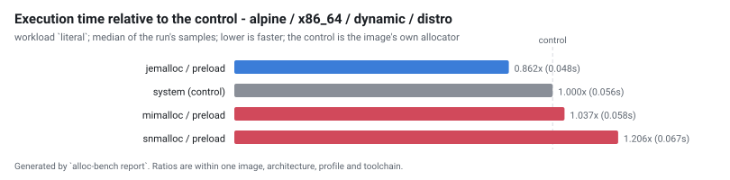
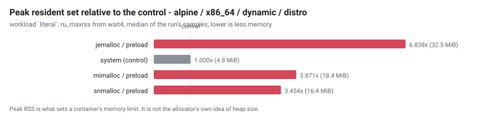
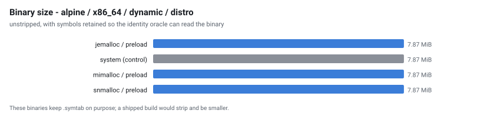
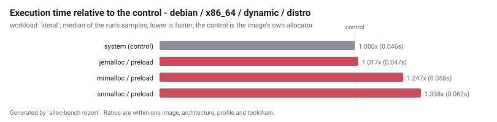
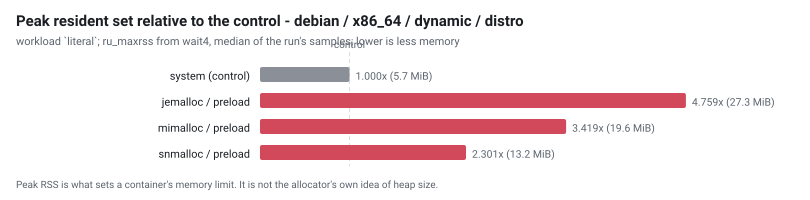
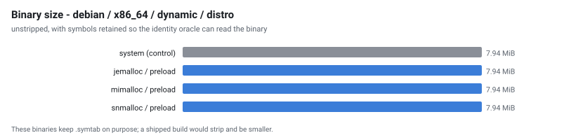

# Allocator benchmark - run `20260902-133258`

Generated by `alloc-bench report`.  Do not edit: it is overwritten from the dataset in `results/`.

## What this run does not establish

Read this before the tables. It is not a disclaimer; it is the list of questions these numbers cannot answer.

| | |
| --- | --- |
| **one machine, one day** | `AMD EPYC 7763 64-Core Processor`, 4 × `x86_64`, 15989 MiB RAM, kernel `Linux 6.17.0-1022-azure`. Absolute timings here do not transfer to other hardware. Ratios within a group are the transferable part, and even those are measured, not guaranteed. |
| **cells that could not exist** | 4 configuration(s) are unsupported, each with a recorded technical reason. They are listed below rather than dropped. |
| **cells that failed** | 0 configuration(s) were attempted and did not produce a usable result. Also listed below. |
| **noise** | 6 cell(s) measured a relative MAD above the 5% threshold. Differences smaller than that cell's own spread are not attributable to the allocator. |
| **what an allocator is good at generally** | this measures one application (ripgrep) on one corpus shape. ripgrep is not allocation-bound; an allocation-heavy service would rank differently, and nothing here says otherwise. |
| **security** | hardened_malloc trades performance for memory-safety mitigations. A slower row for it is the expected cost of what it does, not a defect, and this project makes no claim about whether those mitigations work. |

## Conditions

| | |
| --- | --- |
| run id | `20260902-133258` |
| started | 2026-09-02T13:32:58Z |
| suites | preload |
| repository commit | `c60ae40b1c6c572137f8b4a4523859b9170d8e4a` |
| corpus seed | `20260901` |
| container runtime | docker 28.0.4 |
| primary workload | `literal` |
| GITHUB_REF | `refs/heads/main` |
| GITHUB_REPOSITORY | `Azathothas/alloc-bench` |
| GITHUB_RUN_ATTEMPT | `1` |
| GITHUB_RUN_ID | `33636229346` |
| GITHUB_RUN_NUMBER | `8` |
| GITHUB_SHA | `c60ae40b1c6c572137f8b4a4523859b9170d8e4a` |
| GITHUB_WORKFLOW | `bench` |
| ImageOS | `ubuntu24` |
| ImageVersion | `20260823.283.1` |
| RUNNER_ARCH | `X64` |
| RUNNER_NAME | `GitHub Actions 1000010676` |
| RUNNER_OS | `Linux` |

### Exactly what produced these numbers

| component | ref | commit |
| --- | --- | --- |
| `hardened_malloc` | release `14` | [`1d7fc7ffe0f8`](https://github.com/GrapheneOS/hardened_malloc/commit/1d7fc7ffe0f8068a32ab2ba33df7515e7bad3f5f) |
| `jemalloc` | release `5.3.1` | [`81034ce1f137`](https://github.com/jemalloc/jemalloc/commit/81034ce1f1373e37dc865038e1bc8eeecf559ce8) |
| `mesh` | branch `master` | [`2987f883b869`](https://github.com/plasma-umass/mesh/commit/2987f883b8695c07a80dc40da67c61f524460dfd) |
| `mimalloc` | release `v3.5.0` | [`18b08671c930`](https://github.com/microsoft/mimalloc/commit/18b08671c9302247bfb682286e6bf3cc1773f801) |
| `ripgrep` | release `15.2.0` | [`e89fff89ac9a`](https://github.com/BurntSushi/ripgrep/commit/e89fff89ac9af12e8d4ce9d5fd07beb408ca730f) |
| `rpmalloc` | release `2.0.1` | [`beef233c176b`](https://github.com/mjansson/rpmalloc/commit/beef233c176b235587c0145f765e4316e5ca60d1) |
| `snmalloc` | release `0.7.5` | [`526c55bdffa1`](https://github.com/microsoft/snmalloc/commit/526c55bdffa17aae20a9a3d24fe68a7a3b8d9894) |
| `tcmalloc` | branch `master` | [`897c9eaf5d31`](https://github.com/google/tcmalloc/commit/897c9eaf5d31a94ca9983782de5d6c3c347e609e) |

## Rankings

Ordered by median execution time on `literal`, fastest first. `rel` is the ratio against the control in the SAME image, architecture, profile and toolchain - no ratio crosses a group. `MAD` is the relative median absolute deviation of that cell's own samples: **a difference smaller than the MAD is not a result**.

Composite, where shown: `composite = 0.60 x (time / baseline_time) + 0.30 x (peak_rss / baseline_peak_rss) + 0.10 x (binary_bytes / baseline_binary_bytes); lower is better, 1.000 is the control`.

### alpine / x86_64 / dynamic / distro

| # | allocator | mechanism | time (s) | rel | MAD | peak RSS (MiB) | rel | size (MiB) | startup (s) | composite |
| --- | --- | --- | --- | --- | --- | --- | --- | --- | --- | --- |
| 1 | jemalloc | `preload` | 0.048 | 0.862 | 1.3% | 32.535 | 6.838 | 7.87 | 0.002 | 2.669 |
| 2 | system *(control)* | `baseline` | 0.056 | 1.000 | 1.1% | 4.758 | 1.000 | 7.87 | 0.002 | 1.000 |
| 3 | mimalloc | `preload` | 0.058 | 1.037 | 2.5% | 18.418 | 3.871 | 7.87 | 0.002 | 1.884 |
| 4 | snmalloc | `preload` | 0.067 | 1.206 | 1.7% | 16.434 | 3.454 | 7.87 | 0.002 | 1.860 |

> **Fastest: jemalloc (preload).** jemalloc is 16.0% faster than the next row, which is outside the run's spread of 1.3%

### debian / x86_64 / dynamic / distro

| # | allocator | mechanism | time (s) | rel | MAD | peak RSS (MiB) | rel | size (MiB) | startup (s) | composite |
| --- | --- | --- | --- | --- | --- | --- | --- | --- | --- | --- |
| 1 | system *(control)* | `baseline` | 0.046 | 1.000 | 0.8% | 5.736 | 1.000 | 7.94 | 0.002 | 1.000 |
| 2 | jemalloc | `preload` | 0.047 | 1.017 | 2.0% | 27.297 | 4.759 | 7.94 | 0.002 | 2.138 |
| 3 | mimalloc | `preload` | 0.058 | 1.247 | 0.9% | 19.615 | 3.419 | 7.94 | 0.002 | 1.874 |
| 4 | snmalloc | `preload` | 0.062 | 1.338 | 5.1% | 13.201 | 2.301 | 7.94 | 0.002 | 1.593 |

>  **No winner is claimed here.** the lead of 1.7% is within this run's own spread (2.0% relative MAD), so the ordering between the top rows is not established here

## Every workload

The ranking above uses one workload. These are all of them, as median seconds, so a reader can see whether the ordering holds or whether it is an artefact of one shape of work.

| cell | files | json | literal | literal-j1 | nomatch | regex | startup |
| --- | --- | --- | --- | --- | --- | --- | --- |
| `alpine-x86_64-jemalloc-preload-dynamic-distro` | 0.045 | 0.044 | 0.048 | 0.123 | 0.030 | 0.051 | 0.002 |
| `alpine-x86_64-mimalloc-preload-dynamic-distro` | 0.056 | 0.054 | 0.058 | 0.128 | 0.040 | 0.060 | 0.002 |
| `alpine-x86_64-snmalloc-preload-dynamic-distro` | 0.059 | 0.057 | 0.067 | 0.129 | 0.038 | 0.066 | 0.002 |
| `alpine-x86_64-system-baseline-dynamic-distro` | 0.053 | 0.050 | 0.056 | 0.124 | 0.036 | 0.059 | 0.002 |
| `debian-x86_64-jemalloc-preload-dynamic-distro` | 0.044 | 0.040 | 0.047 | 0.118 | 0.029 | 0.048 | 0.002 |
| `debian-x86_64-mimalloc-preload-dynamic-distro` | 0.054 | 0.050 | 0.058 | 0.120 | 0.037 | 0.059 | 0.002 |
| `debian-x86_64-snmalloc-preload-dynamic-distro` | 0.059 | 0.052 | 0.062 | 0.125 | 0.037 | 0.065 | 0.002 |
| `debian-x86_64-system-baseline-dynamic-distro` | 0.043 | 0.039 | 0.046 | 0.118 | 0.030 | 0.049 | 0.002 |

## Address-space randomisation, observed

Read from `/proc/<pid>/maps` while each binary was running, not inferred from the ELF type. A static non-PIE executable is loaded at a fixed address; a static PIE is not.

| cell | profile | link kind | distinct load addresses | randomised |
| --- | --- | --- | --- | --- |
| `alpine-x86_64-jemalloc-preload-dynamic-distro` | dynamic | dynamic | 6 of 6 | true |
| `alpine-x86_64-mimalloc-preload-dynamic-distro` | dynamic | dynamic | 6 of 6 | true |
| `alpine-x86_64-snmalloc-preload-dynamic-distro` | dynamic | dynamic | 6 of 6 | true |
| `alpine-x86_64-system-baseline-dynamic-distro` | dynamic | dynamic | 6 of 6 | true |
| `debian-x86_64-jemalloc-preload-dynamic-distro` | dynamic | dynamic | 6 of 6 | true |
| `debian-x86_64-mimalloc-preload-dynamic-distro` | dynamic | dynamic | 6 of 6 | true |
| `debian-x86_64-snmalloc-preload-dynamic-distro` | dynamic | dynamic | 6 of 6 | true |
| `debian-x86_64-system-baseline-dynamic-distro` | dynamic | dynamic | 6 of 6 | true |

## Preloaded libraries, observed resident

 A preload cell's allocator is **not in its binary**, so the ELF oracle that identifies every other mechanism has nothing to read. These rows are read from `/proc/<pid>/maps` of the running subject: mapped with `LD_PRELOAD` set, and absent without it.  The empty control is what makes the positive mean anything.

| cell | allocator | mapped with LD_PRELOAD | mapped without (control) |
| --- | --- | --- | --- |
| `alpine-x86_64-jemalloc-preload-dynamic-distro` | jemalloc | 4 of 4 sampled | 0 of 4 sampled |
| `alpine-x86_64-mimalloc-preload-dynamic-distro` | mimalloc | 4 of 4 sampled | 0 of 4 sampled |
| `alpine-x86_64-snmalloc-preload-dynamic-distro` | snmalloc | 4 of 4 sampled | 0 of 4 sampled |
| `debian-x86_64-jemalloc-preload-dynamic-distro` | jemalloc | 4 of 4 sampled | 0 of 4 sampled |
| `debian-x86_64-mimalloc-preload-dynamic-distro` | mimalloc | 4 of 4 sampled | 0 of 4 sampled |
| `debian-x86_64-snmalloc-preload-dynamic-distro` | snmalloc | 4 of 4 sampled | 0 of 4 sampled |

## Configurations that could not exist

 These are results. Each names a concrete technical reason, and a future upstream release that removes the reason turns the row into a measurement without anyone editing prose.

| cell | reason |
| --- | --- |
| `alpine-x86_64-mesh-preload-dynamic-distro` | Mesh's build produced neither a static archive nor a shared object under /cache/alloc/mesh-2987f883b8695c07a80dc40da67c61f524460dfd-preload-pic1-musl-x86_64-distro-default/.build; the artefacts it did leave are listed on stderr |
| `alpine-x86_64-tcmalloc-preload-dynamic-distro` | upstream does not support musl; the Bazel build requires glibc-specific interfaces. |
| `debian-x86_64-mesh-preload-dynamic-distro` | Mesh's build produced neither a static archive nor a shared object under /cache/alloc/mesh-2987f883b8695c07a80dc40da67c61f524460dfd-preload-pic1-glibc-x86_64-distro-default/.build; the artefacts it did leave are listed on stderr |
| `debian-x86_64-tcmalloc-preload-dynamic-distro` | the bazel build produced no shared object usable for LD_PRELOAD under bazel-bin; what it did leave is listed on stderr |

## Configurations that failed

None in this run.

## Validation

`alloc-bench validate` checks the dataset before this report is written. An `ERROR` means the ranking above must not be trusted; the exit status reflects it.

| severity | check | cell | message |
| --- | --- | --- | --- |
| warn | `noisy` | `alpine-x86_64-mimalloc-preload-dynamic-distro` | workload nomatch has a relative MAD of 5.0%, above the 5% threshold; differences smaller than that cannot be attributed to the allocator on this host |
| warn | `noisy` | `alpine-x86_64-mimalloc-preload-dynamic-distro` | workload startup has a relative MAD of 6.7%, above the 5% threshold; differences smaller than that cannot be attributed to the allocator on this host |
| warn | `noisy` | `debian-x86_64-jemalloc-preload-dynamic-distro` | workload startup has a relative MAD of 10.1%, above the 5% threshold; differences smaller than that cannot be attributed to the allocator on this host |
| warn | `noisy` | `debian-x86_64-mimalloc-preload-dynamic-distro` | workload startup has a relative MAD of 19.8%, above the 5% threshold; differences smaller than that cannot be attributed to the allocator on this host |
| warn | `noisy` | `debian-x86_64-snmalloc-preload-dynamic-distro` | workload literal has a relative MAD of 5.1%, above the 5% threshold; differences smaller than that cannot be attributed to the allocator on this host |
| warn | `noisy` | `debian-x86_64-snmalloc-preload-dynamic-distro` | workload startup has a relative MAD of 15.2%, above the 5% threshold; differences smaller than that cannot be attributed to the allocator on this host |

---

12 cell(s) planned, 8 produced a usable result, 4 unsupported, 0 failed.

Raw samples, build metadata, identity evidence and correctness output for every cell are in `results/` and `cells/` beside this file.  Every number above is derived from them; none was typed in.
