# Allocator benchmark - run `20260902-120754`

Generated by `alloc-bench report`.  Do not edit: it is overwritten from the dataset in `results/`.

## What this run does not establish

Read this before the tables. It is not a disclaimer; it is the list of questions these numbers cannot answer.

| | |
| --- | --- |
| **one machine, one day** | `AMD EPYC 7763 64-Core Processor`, 4 × `x86_64`, 15989 MiB RAM, kernel `Linux 6.17.0-1022-azure`. Absolute timings here do not transfer to other hardware. Ratios within a group are the transferable part, and even those are measured, not guaranteed. |
| **cells that could not exist** | 0 configuration(s) are unsupported, each with a recorded technical reason. They are listed below rather than dropped. |
| **cells that failed** | 0 configuration(s) were attempted and did not produce a usable result. Also listed below. |
| **noise** | 6 cell(s) measured a relative MAD above the 5% threshold. Differences smaller than that cell's own spread are not attributable to the allocator. |
| **what an allocator is good at generally** | this measures one application (ripgrep) on one corpus shape. ripgrep is not allocation-bound; an allocation-heavy service would rank differently, and nothing here says otherwise. |
| **security** | hardened_malloc trades performance for memory-safety mitigations. A slower row for it is the expected cost of what it does, not a defect, and this project makes no claim about whether those mitigations work. |

## Conditions

| | |
| --- | --- |
| run id | `20260902-120754` |
| started | 2026-09-02T12:07:54Z |
| suites | profiles |
| repository commit | `7ba360c9c3bcc9f243b6d1bd76aa9b1b4a58c019` |
| corpus seed | `20260901` |
| container runtime | docker 28.0.4 |
| primary workload | `literal` |
| GITHUB_REF | `refs/heads/main` |
| GITHUB_REPOSITORY | `Azathothas/alloc-bench` |
| GITHUB_RUN_ATTEMPT | `1` |
| GITHUB_RUN_ID | `33628116410` |
| GITHUB_RUN_NUMBER | `7` |
| GITHUB_SHA | `7ba360c9c3bcc9f243b6d1bd76aa9b1b4a58c019` |
| GITHUB_WORKFLOW | `bench` |
| ImageOS | `ubuntu24` |
| ImageVersion | `20260823.283.1` |
| RUNNER_ARCH | `X64` |
| RUNNER_NAME | `GitHub Actions 1000010663` |
| RUNNER_OS | `Linux` |

### Exactly what produced these numbers

| component | ref | commit |
| --- | --- | --- |
| `hardened_malloc` | release `14` | [`1d7fc7ffe0f8`](https://github.com/GrapheneOS/hardened_malloc/commit/1d7fc7ffe0f8068a32ab2ba33df7515e7bad3f5f) |
| `jemalloc` | release `5.3.1` | [`81034ce1f137`](https://github.com/jemalloc/jemalloc/commit/81034ce1f1373e37dc865038e1bc8eeecf559ce8) |
| `mesh` | branch `master` | [`2987f883b869`](https://github.com/plasma-umass/mesh/commit/2987f883b8695c07a80dc40da67c61f524460dfd) |
| `mimalloc` | release `v3.5.0` | [`18b08671c930`](https://github.com/microsoft/mimalloc/commit/18b08671c9302247bfb682286e6bf3cc1773f801) |
| `ripgrep` | release `15.2.0` | [`e89fff89ac9a`](https://github.com/BurntSushi/ripgrep/commit/e89fff89ac9af12e8d4ce9d5fd07beb408ca730f) |
| `rpmalloc` | release `2.0.1` | [`beef233c176b`](https://github.com/mjansson/rpmalloc/commit/beef233c176b235587c0145f765e4316e5ca60d1) |
| `snmalloc` | release `0.7.5` | [`526c55bdffa1`](https://github.com/microsoft/snmalloc/commit/526c55bdffa17aae20a9a3d24fe68a7a3b8d9894) |
| `tcmalloc` | branch `master` | [`897c9eaf5d31`](https://github.com/google/tcmalloc/commit/897c9eaf5d31a94ca9983782de5d6c3c347e609e) |

## Rankings

Ordered by median execution time on `literal`, fastest first. `rel` is the ratio against the control in the SAME image, architecture, profile and toolchain - no ratio crosses a group. `MAD` is the relative median absolute deviation of that cell's own samples: **a difference smaller than the MAD is not a result**.

Composite, where shown: `composite = 0.60 x (time / baseline_time) + 0.30 x (peak_rss / baseline_peak_rss) + 0.10 x (binary_bytes / baseline_binary_bytes); lower is better, 1.000 is the control`.

### alpine / x86_64 / static / distro

| # | allocator | mechanism | time (s) | rel | MAD | peak RSS (MiB) | rel | size (MiB) | startup (s) | composite |
| --- | --- | --- | --- | --- | --- | --- | --- | --- | --- | --- |
| 1 | jemalloc | `rust-global` | 0.049 | 0.848 | 0.9% | 31.117 | 8.991 | 13.79 | 0.001 | 3.383 |
| 2 | system *(control)* | `baseline` | 0.058 | 1.000 | 1.8% | 3.461 | 1.000 | 7.79 | 0.001 | 1.000 |
| 3 | mimalloc | `rust-global` | 0.058 | 1.007 | 2.0% | 16.988 | 4.909 | 8.02 | 0.001 | 2.180 |
| 4 | snmalloc | `rust-global` | 0.067 | 1.150 | 1.7% | 15.090 | 4.360 | 8.34 | 0.001 | 2.105 |

> **Fastest: jemalloc (rust-global).** jemalloc is 17.9% faster than the next row, which is outside the run's spread of 1.8%

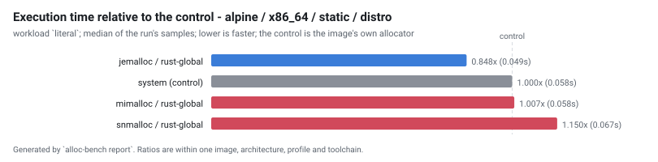

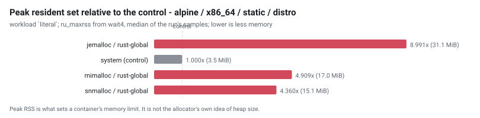

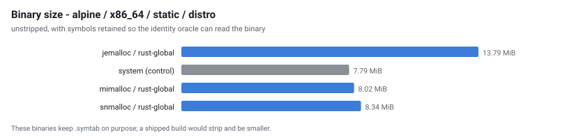

### alpine / x86_64 / static-lto / distro

| # | allocator | mechanism | time (s) | rel | MAD | peak RSS (MiB) | rel | size (MiB) | startup (s) | composite |
| --- | --- | --- | --- | --- | --- | --- | --- | --- | --- | --- |
| 1 | jemalloc | `rust-global` | 0.048 | 0.848 | 0.9% | 31.285 | 8.603 | 12.32 | 0.001 | 3.284 |
| 2 | mimalloc | `rust-global` | 0.057 | 0.998 | 2.1% | 17.311 | 4.760 | 6.55 | 0.001 | 2.130 |
| 3 | system *(control)* | `baseline` | 0.057 | 1.000 | 1.1% | 3.637 | 1.000 | 6.35 | 0.001 | 1.000 |
| 4 | snmalloc | `rust-global` | 0.065 | 1.141 | 1.6% | 15.258 | 4.195 | 6.87 | 0.001 | 2.052 |

> **Fastest: jemalloc (rust-global).** jemalloc is 17.7% faster than the next row, which is outside the run's spread of 2.1%

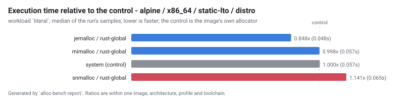

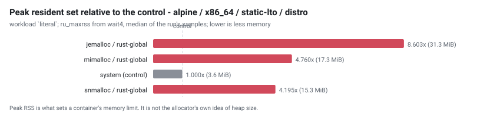

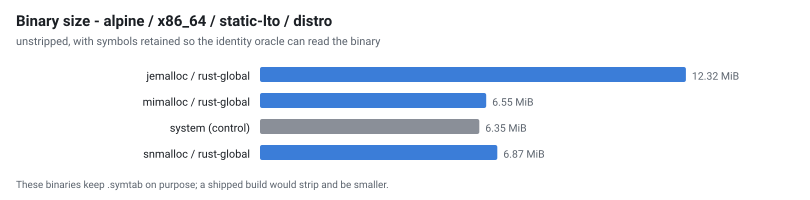

### alpine / x86_64 / static-pie / distro

| # | allocator | mechanism | time (s) | rel | MAD | peak RSS (MiB) | rel | size (MiB) | startup (s) | composite |
| --- | --- | --- | --- | --- | --- | --- | --- | --- | --- | --- |
| 1 | jemalloc | `rust-global` | 0.049 | 0.823 | 0.7% | 31.605 | 5.497 | 14.20 | 0.001 | 2.317 |
| 2 | mimalloc | `rust-global` | 0.059 | 0.981 | 2.2% | 17.539 | 3.050 | 8.38 | 0.001 | 1.607 |
| 3 | system *(control)* | `baseline` | 0.060 | 1.000 | 1.3% | 5.750 | 1.000 | 8.15 | 0.001 | 1.000 |
| 4 | snmalloc | `rust-global` | 0.066 | 1.102 | 0.9% | 15.305 | 2.662 | 8.70 | 0.001 | 1.567 |

> **Fastest: jemalloc (rust-global).** jemalloc is 19.3% faster than the next row, which is outside the run's spread of 2.2%

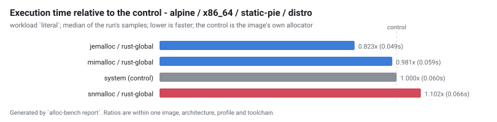

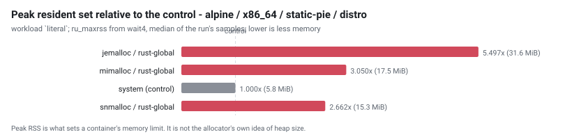

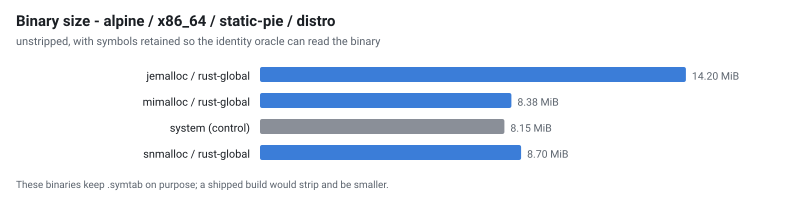

### alpine / x86_64 / static-pie-lto / distro

| # | allocator | mechanism | time (s) | rel | MAD | peak RSS (MiB) | rel | size (MiB) | startup (s) | composite |
| --- | --- | --- | --- | --- | --- | --- | --- | --- | --- | --- |
| 1 | jemalloc | `rust-global` | 0.049 | 0.845 | 0.5% | 31.441 | 5.496 | 12.67 | 0.001 | 2.347 |
| 2 | mimalloc | `rust-global` | 0.057 | 0.994 | 0.5% | 17.703 | 3.095 | 6.85 | 0.001 | 1.628 |
| 3 | system *(control)* | `baseline` | 0.058 | 1.000 | 1.3% | 5.721 | 1.000 | 6.63 | 0.001 | 1.000 |
| 4 | snmalloc | `rust-global` | 0.065 | 1.129 | 1.4% | 15.590 | 2.725 | 7.17 | 0.001 | 1.603 |

> **Fastest: jemalloc (rust-global).** jemalloc is 17.6% faster than the next row, which is outside the run's spread of 0.5%

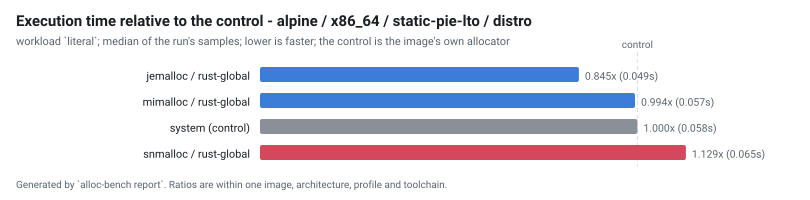

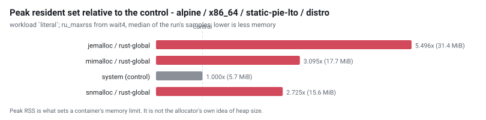

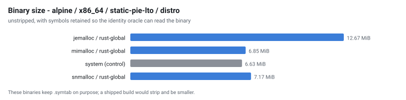

## Every workload

The ranking above uses one workload. These are all of them, as median seconds, so a reader can see whether the ordering holds or whether it is an artefact of one shape of work.

| cell | files | json | literal | literal-j1 | nomatch | regex | startup |
| --- | --- | --- | --- | --- | --- | --- | --- |
| `alpine-x86_64-jemalloc-rust-global-static-distro` | 0.046 | 0.042 | 0.049 | 0.123 | 0.030 | 0.051 | 0.001 |
| `alpine-x86_64-jemalloc-rust-global-static-lto-distro` | 0.045 | 0.041 | 0.048 | 0.119 | 0.029 | 0.050 | 0.001 |
| `alpine-x86_64-jemalloc-rust-global-static-pie-distro` | 0.045 | 0.041 | 0.049 | 0.119 | 0.029 | 0.051 | 0.001 |
| `alpine-x86_64-jemalloc-rust-global-static-pie-lto-distro` | 0.046 | 0.043 | 0.049 | 0.120 | 0.029 | 0.051 | 0.001 |
| `alpine-x86_64-mimalloc-rust-global-static-distro` | 0.054 | 0.050 | 0.058 | 0.129 | 0.038 | 0.059 | 0.001 |
| `alpine-x86_64-mimalloc-rust-global-static-lto-distro` | 0.054 | 0.049 | 0.057 | 0.126 | 0.037 | 0.060 | 0.001 |
| `alpine-x86_64-mimalloc-rust-global-static-pie-distro` | 0.055 | 0.051 | 0.059 | 0.129 | 0.038 | 0.060 | 0.001 |
| `alpine-x86_64-mimalloc-rust-global-static-pie-lto-distro` | 0.054 | 0.049 | 0.057 | 0.129 | 0.037 | 0.059 | 0.001 |
| `alpine-x86_64-snmalloc-rust-global-static-distro` | 0.062 | 0.055 | 0.067 | 0.130 | 0.038 | 0.066 | 0.001 |
| `alpine-x86_64-snmalloc-rust-global-static-lto-distro` | 0.061 | 0.055 | 0.065 | 0.129 | 0.038 | 0.068 | 0.001 |
| `alpine-x86_64-snmalloc-rust-global-static-pie-distro` | 0.062 | 0.057 | 0.066 | 0.130 | 0.039 | 0.067 | 0.001 |
| `alpine-x86_64-snmalloc-rust-global-static-pie-lto-distro` | 0.062 | 0.054 | 0.065 | 0.130 | 0.038 | 0.066 | 0.001 |
| `alpine-x86_64-system-baseline-static-distro` | 0.052 | 0.047 | 0.058 | 0.124 | 0.034 | 0.056 | 0.001 |
| `alpine-x86_64-system-baseline-static-lto-distro` | 0.052 | 0.047 | 0.057 | 0.121 | 0.033 | 0.056 | 0.001 |
| `alpine-x86_64-system-baseline-static-pie-distro` | 0.053 | 0.048 | 0.060 | 0.123 | 0.034 | 0.058 | 0.001 |
| `alpine-x86_64-system-baseline-static-pie-lto-distro` | 0.052 | 0.046 | 0.058 | 0.121 | 0.034 | 0.056 | 0.001 |

## Address-space randomisation, observed

Read from `/proc/<pid>/maps` while each binary was running, not inferred from the ELF type. A static non-PIE executable is loaded at a fixed address; a static PIE is not.

| cell | profile | link kind | distinct load addresses | randomised |
| --- | --- | --- | --- | --- |
| `alpine-x86_64-jemalloc-rust-global-static-distro` | static | static | 1 of 6 | false |
| `alpine-x86_64-jemalloc-rust-global-static-lto-distro` | static-lto | static | 1 of 6 | false |
| `alpine-x86_64-jemalloc-rust-global-static-pie-distro` | static-pie | static-pie | 6 of 6 | true |
| `alpine-x86_64-jemalloc-rust-global-static-pie-lto-distro` | static-pie-lto | static-pie | 6 of 6 | true |
| `alpine-x86_64-mimalloc-rust-global-static-distro` | static | static | 1 of 6 | false |
| `alpine-x86_64-mimalloc-rust-global-static-lto-distro` | static-lto | static | 1 of 6 | false |
| `alpine-x86_64-mimalloc-rust-global-static-pie-distro` | static-pie | static-pie | 6 of 6 | true |
| `alpine-x86_64-mimalloc-rust-global-static-pie-lto-distro` | static-pie-lto | static-pie | 6 of 6 | true |
| `alpine-x86_64-snmalloc-rust-global-static-distro` | static | static | 1 of 6 | false |
| `alpine-x86_64-snmalloc-rust-global-static-lto-distro` | static-lto | static | 1 of 6 | false |
| `alpine-x86_64-snmalloc-rust-global-static-pie-distro` | static-pie | static-pie | 6 of 6 | true |
| `alpine-x86_64-snmalloc-rust-global-static-pie-lto-distro` | static-pie-lto | static-pie | 6 of 6 | true |
| `alpine-x86_64-system-baseline-static-distro` | static | static | 1 of 6 | false |
| `alpine-x86_64-system-baseline-static-lto-distro` | static-lto | static | 1 of 6 | false |
| `alpine-x86_64-system-baseline-static-pie-distro` | static-pie | static-pie | 6 of 6 | true |
| `alpine-x86_64-system-baseline-static-pie-lto-distro` | static-pie-lto | static-pie | 6 of 6 | true |

## Configurations that could not exist

None in this run.

## Configurations that failed

None in this run.

## Validation

`alloc-bench validate` checks the dataset before this report is written. An `ERROR` means the ranking above must not be trusted; the exit status reflects it.

| severity | check | cell | message |
| --- | --- | --- | --- |
| warn | `noisy` | `alpine-x86_64-jemalloc-rust-global-static-pie-distro` | workload startup has a relative MAD of 9.0%, above the 5% threshold; differences smaller than that cannot be attributed to the allocator on this host |
| warn | `noisy` | `alpine-x86_64-mimalloc-rust-global-static-pie-lto-distro` | workload startup has a relative MAD of 6.6%, above the 5% threshold; differences smaller than that cannot be attributed to the allocator on this host |
| warn | `noisy` | `alpine-x86_64-snmalloc-rust-global-static-distro` | workload startup has a relative MAD of 8.4%, above the 5% threshold; differences smaller than that cannot be attributed to the allocator on this host |
| warn | `noisy` | `alpine-x86_64-snmalloc-rust-global-static-lto-distro` | workload startup has a relative MAD of 9.9%, above the 5% threshold; differences smaller than that cannot be attributed to the allocator on this host |
| warn | `noisy` | `alpine-x86_64-snmalloc-rust-global-static-pie-distro` | workload startup has a relative MAD of 7.3%, above the 5% threshold; differences smaller than that cannot be attributed to the allocator on this host |
| warn | `noisy` | `alpine-x86_64-snmalloc-rust-global-static-pie-lto-distro` | workload startup has a relative MAD of 8.0%, above the 5% threshold; differences smaller than that cannot be attributed to the allocator on this host |

---

16 cell(s) planned, 16 produced a usable result, 0 unsupported, 0 failed.

Raw samples, build metadata, identity evidence and correctness output for every cell are in `results/` and `cells/` beside this file.  Every number above is derived from them; none was typed in.
