# Allocator benchmark - run `20260903-035021`

Generated by `alloc-bench report`.  Do not edit: it is overwritten from the dataset in `results/`.

## What this run does not establish

Read this before the tables. It is not a disclaimer; it is the list of questions these numbers cannot answer.

| | |
| --- | --- |
| **one machine, one day** | `Intel(R) Xeon(R) Processor @ 2.10GHz`, 4 × `x86_64`, 16075 MiB RAM, kernel `Linux 6.18.44-fc-v24`. Absolute timings here do not transfer to other hardware. Ratios within a group are the transferable part, and even those are measured, not guaranteed. |
| **cells that could not exist** | 0 configuration(s) are unsupported, each with a recorded technical reason. They are listed below rather than dropped. |
| **cells that failed** | 2 configuration(s) were attempted and did not produce a usable result. Also listed below. |
| **noise** | 63 cell(s) measured a relative MAD above the 5% threshold. Differences smaller than that cell's own spread are not attributable to the allocator. |
| **what an allocator is good at generally** | this measures one application (ripgrep) on one corpus shape. ripgrep is not allocation-bound; an allocation-heavy service would rank differently, and nothing here says otherwise. |
| **security** | hardened_malloc trades performance for memory-safety mitigations. A slower row for it is the expected cost of what it does, not a defect, and this project makes no claim about whether those mitigations work. |

## Conditions

| | |
| --- | --- |
| run id | `20260903-035021` |
| started | 2026-09-03T03:50:21Z |
| suites | libc-contrast |
| repository commit | `eb689d42d153096999c2dabcf01203a10df38022` |
| corpus seed | `20260901` |
| container runtime | docker 29.3.1 |
| primary workload | `literal` |

### Exactly what produced these numbers

| component | ref | commit |
| --- | --- | --- |
| `hardened_malloc` | release `14` | [`1d7fc7ffe0f8`](https://github.com/GrapheneOS/hardened_malloc/commit/1d7fc7ffe0f8068a32ab2ba33df7515e7bad3f5f) |
| `jemalloc` | release `5.3.1` | [`81034ce1f137`](https://github.com/jemalloc/jemalloc/commit/81034ce1f1373e37dc865038e1bc8eeecf559ce8) |
| `mesh` | branch `master` | [`2987f883b869`](https://github.com/plasma-umass/mesh/commit/2987f883b8695c07a80dc40da67c61f524460dfd) |
| `mimalloc` | release `v3.5.0` | [`18b08671c930`](https://github.com/microsoft/mimalloc/commit/18b08671c9302247bfb682286e6bf3cc1773f801) |
| `ripgrep` | release `15.2.0` | [`e89fff89ac9a`](https://github.com/BurntSushi/ripgrep/commit/e89fff89ac9af12e8d4ce9d5fd07beb408ca730f) |
| `rpmalloc` | release `2.0.1` | [`beef233c176b`](https://github.com/mjansson/rpmalloc/commit/beef233c176b235587c0145f765e4316e5ca60d1) |
| `snmalloc` | release `0.7.5` | [`526c55bdffa1`](https://github.com/microsoft/snmalloc/commit/526c55bdffa17aae20a9a3d24fe68a7a3b8d9894) |
| `tcmalloc` | branch `master` | [`897c9eaf5d31`](https://github.com/google/tcmalloc/commit/897c9eaf5d31a94ca9983782de5d6c3c347e609e) |

## Rankings

Ordered by median execution time on `literal`, fastest first. `rel` is the ratio against the control in the SAME image, architecture, profile and toolchain - no ratio crosses a group. `MAD` is the relative median absolute deviation of that cell's own samples: **a difference smaller than the MAD is not a result**.

**How to read it.** Every measured column is one where **lower is better**, marked `↓` in the header: less time, less memory, a smaller binary and a tighter spread are all the good direction. A `rel` under `1.000×` beat the control and one over it lost.

| marker | meaning |
| --- | --- |
| `↓` in a header | lower is better for this column |
| `≈ control` |  this row's distance from the control is **smaller than its own MAD**, so this run does not establish that it is faster or slower. §9's rule, applied per row. |
| `–` | not measured.  Never a zero, and never a blank that could be read as one. |

Composite, where shown: `composite = 0.60 x (time / baseline_time) + 0.30 x (peak_rss / baseline_peak_rss) + 0.10 x (binary_bytes / baseline_binary_bytes); lower is better, 1.000 is the control` - also **lower is better**, and every component is published separately so a reader who weighs them differently can re-rank.

### alpine / x86_64 / static-pie / distro

| # | allocator | mechanism | time (s) ↓ | vs control ↓ | MAD ↓ | peak RSS (MiB) ↓ | vs control ↓ | size (MiB) ↓ | startup (s) ↓ | composite ↓ |
| --- | --- | --- | --- | --- | --- | --- | --- | --- | --- | --- |
| 1 | snmalloc | `rust-global` | 0.033 | 0.619× (38.1% faster) | 3.9% | 6.941 | 1.520× (52.0% more) | 8.70 | 0.001 | 0.934 |
| 2 | jemalloc | `rust-global` | 0.034 | 0.638× (36.2% faster) | 3.8% | 7.379 | 1.616× (61.6% more) | 13.75 | 0.001 | 1.037 |
| 3 | rpmalloc | `rust-global` | 0.034 | 0.638× (36.2% faster) | 8.5% | 4.879 | 1.068× (6.8% more) | 8.24 | 0.001 | 0.805 |
| 4 | mimalloc | `rust-global` | 0.035 | 0.650× (35.0% faster) | 2.1% | 15.848 | 3.470× (247.0% more) | 8.37 | 0.002 | 1.534 |
| 5 | hardened_malloc | `rust-global` | 0.049 | 0.919× (8.1% faster) | 2.2% | 13.129 | 2.875× (187.5% more) | 8.17 | 0.003 | 1.514 |
| 6 | system *(control)* | `baseline` | 0.053 | 1.000× *(control)* | 2.4% | 4.566 | 1.000× *(control)* | 8.15 | 0.002 | 1.000 |

>  **No winner is claimed here.** the lead of 3.1% is within this run's own spread (3.9% relative MAD), so the ordering between the top rows is not established here

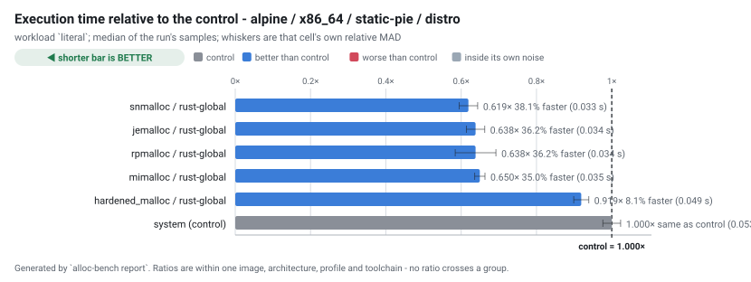

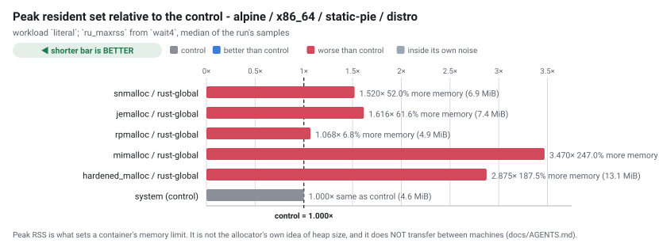

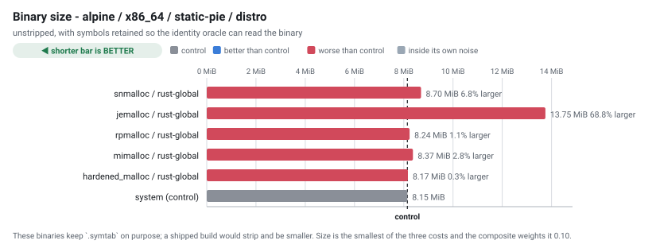

### archlinux / x86_64 / static-pie / distro

| # | allocator | mechanism | time (s) ↓ | vs control ↓ | MAD ↓ | peak RSS (MiB) ↓ | vs control ↓ | size (MiB) ↓ | startup (s) ↓ | composite ↓ |
| --- | --- | --- | --- | --- | --- | --- | --- | --- | --- | --- |
| 1 | system *(control)* | `baseline` | 0.025 | 1.000× *(control)* | 2.4% | 5.582 | 1.000× *(control)* | 9.08 | 0.002 | 1.000 |
| 2 | rpmalloc | `rust-global` | 0.027 | 1.083× (8.3% slower) | 4.2% | 5.789 | 1.037× (3.7% more) | 9.17 | 0.002 | 1.062 |
| 3 | snmalloc | `rust-global` | 0.028 | 1.145× (14.5% slower) | 7.1% | 7.773 | 1.393× (39.3% more) | 9.27 | 0.002 | 1.207 |
| 4 | mimalloc | `rust-global` | 0.028 | 1.147× (14.7% slower) | 7.2% | 18.791 | 3.366× (236.6% more) | 9.31 | 0.002 | 1.800 |
| 5 | jemalloc | `rust-global` | 0.029 | 1.160× (16.0% slower) | 4.1% | 8.383 | 1.502× (50.2% more) | 15.25 | 0.002 | 1.314 |
| 6 | hardened_malloc | `rust-global` | 0.048 | 1.957× (95.7% slower) | 3.3% | 14.164 | 2.537× (153.7% more) | 9.10 | 0.003 | 2.036 |

> **Fastest: system (baseline).** system is 8.3% faster than the next row, which is outside the run's spread of 4.2%

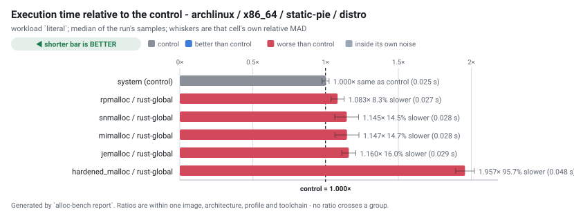

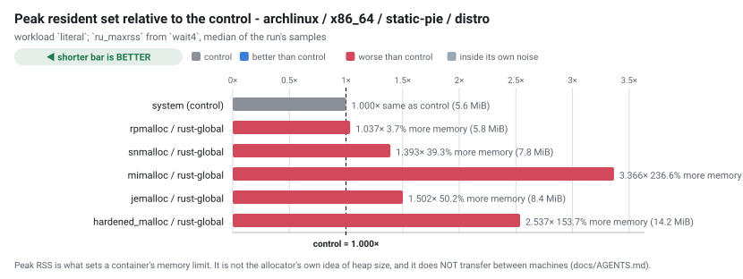

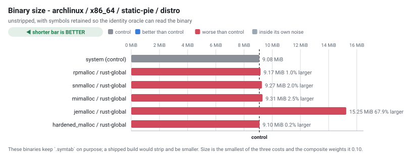

### debian / x86_64 / static-pie / distro

| # | allocator | mechanism | time (s) ↓ | vs control ↓ | MAD ↓ | peak RSS (MiB) ↓ | vs control ↓ | size (MiB) ↓ | startup (s) ↓ | composite ↓ |
| --- | --- | --- | --- | --- | --- | --- | --- | --- | --- | --- |
| 1 | system *(control)* | `baseline` | 0.026 | 1.000× *(control)* | 3.6% | 5.402 | 1.000× *(control)* | 9.02 | 0.002 | 1.000 |
| 2 | snmalloc | `rust-global` | 0.027 | 1.007×  ≈ control | 3.4% | 7.703 | 1.426× (42.6% more) | 9.19 | 0.002 | 1.134 |
| 3 | rpmalloc | `rust-global` | 0.027 | 1.008×  ≈ control | 1.8% | 5.664 | 1.048× (4.8% more) | 9.11 | 0.002 | 1.020 |
| 4 | jemalloc | `rust-global` | 0.027 | 1.031× (3.1% slower) | 2.7% | 8.109 | 1.501× (50.1% more) | 14.86 | 0.002 | 1.233 |
| 5 | mimalloc | `rust-global` | 0.029 | 1.094× (9.4% slower) | 6.0% | 18.709 | 3.463× (246.3% more) | 9.23 | 0.003 | 1.798 |
| 6 | hardened_malloc | `rust-global` | 0.046 | 1.724× (72.4% slower) | 3.4% | 13.977 | 2.587× (158.7% more) | 9.04 | 0.004 | 1.911 |

>  **No winner is claimed here.** the lead of 0.7% is within this run's own spread (3.6% relative MAD), so the ordering between the top rows is not established here

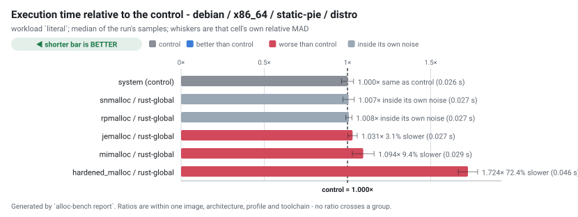

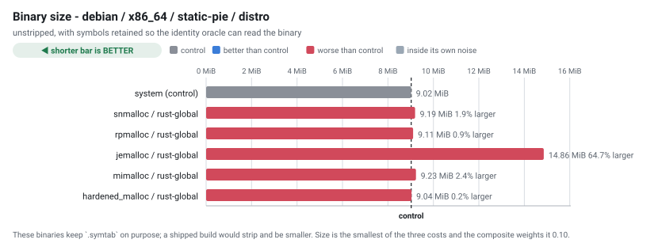

### ubuntu / x86_64 / static-pie / distro

| # | allocator | mechanism | time (s) ↓ | vs control ↓ | MAD ↓ | peak RSS (MiB) ↓ | vs control ↓ | size (MiB) ↓ | startup (s) ↓ | composite ↓ |
| --- | --- | --- | --- | --- | --- | --- | --- | --- | --- | --- |
| 1 | system *(control)* | `baseline` | 0.026 | 1.000× *(control)* | 6.0% | 5.609 | 1.000× *(control)* | 9.11 | 0.002 | 1.000 |
| 2 | snmalloc | `rust-global` | 0.027 | 1.074× (7.4% slower) | 3.9% | 7.750 | 1.382× (38.2% more) | 9.29 | 0.002 | 1.161 |
| 3 | rpmalloc | `rust-global` | 0.028 | 1.081× (8.1% slower) | 0.7% | 5.691 | 1.015× (1.5% more) | 9.20 | 0.002 | 1.054 |
| 4 | jemalloc | `rust-global` | 0.028 | 1.082×  ≈ control | 9.4% | 8.230 | 1.467× (46.7% more) | 14.98 | 0.002 | 1.253 |
| 5 | mimalloc | `rust-global` | 0.030 | 1.164× (16.4% slower) | 4.8% | 18.816 | 3.354× (235.4% more) | 9.33 | 0.002 | 1.807 |
| 6 | hardened_malloc | `rust-global` | 0.046 | 1.785× (78.5% slower) | 6.0% | 14.258 | 2.542× (154.2% more) | 9.13 | 0.004 | 1.934 |

> **Fastest: system (baseline).** system is 7.4% faster than the next row, which is outside the run's spread of 6.0%

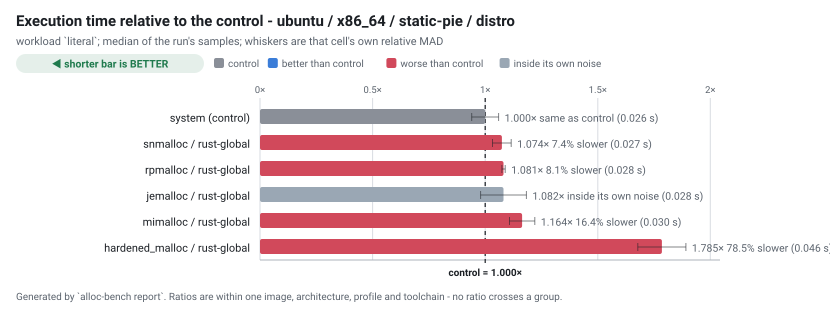

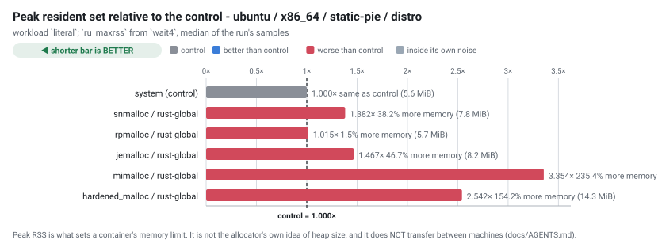

### void / x86_64 / static-pie / distro

| # | allocator | mechanism | time (s) ↓ | vs control ↓ | MAD ↓ | peak RSS (MiB) ↓ | vs control ↓ | size (MiB) ↓ | startup (s) ↓ | composite ↓ |
| --- | --- | --- | --- | --- | --- | --- | --- | --- | --- | --- |
| 1 | rpmalloc | `rust-global` | 0.030 | 0.580× (42.0% faster) | 3.3% | 4.816 | 1.132× (13.2% more) | 8.24 | 0.001 | 0.789 |
| 2 | snmalloc | `rust-global` | 0.031 | 0.601× (39.9% faster) | 1.2% | 6.879 | 1.617× (61.7% more) | 8.20 | 0.002 | 0.946 |
| 3 | jemalloc | `rust-global` | 0.034 | 0.655× (34.5% faster) | 5.6% | 7.055 | 1.658× (65.8% more) | 13.78 | 0.002 | 1.060 |
| 4 | mimalloc | `rust-global` | 0.035 | 0.668× (33.2% faster) | 3.4% | 15.656 | 3.680× (268.0% more) | 8.37 | 0.002 | 1.608 |
| 5 | hardened_malloc | `rust-global` | 0.049 | 0.946× (5.4% faster) | 2.2% | 12.879 | 3.028× (202.8% more) | 8.17 | 0.003 | 1.576 |
| 6 | system *(control)* | `baseline` | 0.052 | 1.000× *(control)* | 6.5% | 4.254 | 1.000× *(control)* | 8.15 | 0.001 | 1.000 |

> **Fastest: rpmalloc (rust-global).** rpmalloc is 3.6% faster than the next row, which is outside the run's spread of 3.3%

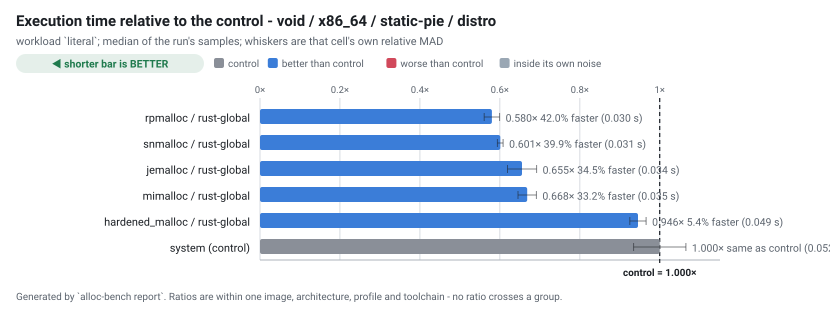

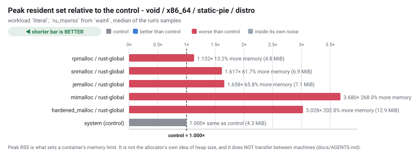

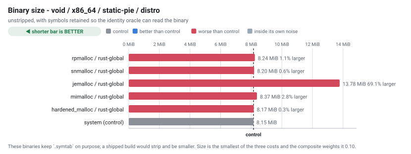

### wolfi / x86_64 / static-pie / distro

| # | allocator | mechanism | time (s) ↓ | vs control ↓ | MAD ↓ | peak RSS (MiB) ↓ | vs control ↓ | size (MiB) ↓ | startup (s) ↓ | composite ↓ |
| --- | --- | --- | --- | --- | --- | --- | --- | --- | --- | --- |
| 1 | mimalloc | `rust-global` | 0.030 | 0.602× (39.8% faster) | 2.5% | 17.436 | 4.606× (360.6% more) | 8.39 | 0.002 | 1.846 |
| 2 | jemalloc | `rust-global` | 0.031 | 0.629× (37.1% faster) | 3.0% | 6.566 | 1.735× (73.5% more) | 14.27 | 0.002 | 1.073 |
| 3 | hardened_malloc | `rust-global` | 0.050 | 0.993×  ≈ control | 4.8% | 12.441 | 3.287× (228.7% more) | 8.17 | 0.003 | 1.682 |
| 4 | system *(control)* | `baseline` | 0.050 | 1.000× *(control)* | 4.5% | 3.785 | 1.000× *(control)* | 8.14 | 0.002 | 1.000 |

> **Fastest: mimalloc (rust-global).** mimalloc is 4.5% faster than the next row, which is outside the run's spread of 3.0%

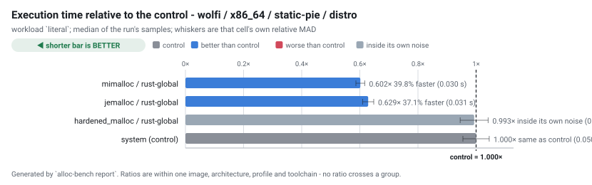

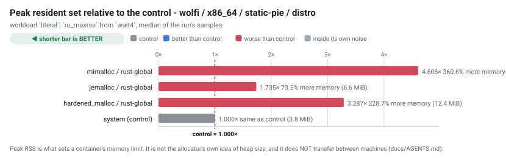

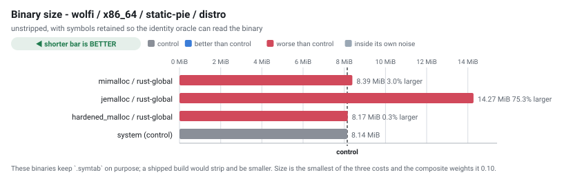

## Which allocator, by libc

Each candidate against **its own distribution's control**, counted across every distribution of that libc in this run.  No ratio crosses a distribution; what is counted is how many distributions it won in.

 **A win means the lead exceeded that cell's own MAD.** Anything smaller is counted as a **tie**, never rounded into a win - lower is better. A cell with no MAD at all counts as a tie, because nothing can be said about whether its difference cleared the noise.

### glibc - 3 distribution(s): `archlinux`, `debian`, `ubuntu`

| allocator | mechanism | beat its control in | lost in | tied in | median ↓ | range ↓ | peak RSS range ↓ |
| --- | --- | --- | --- | --- | --- | --- | --- |
| snmalloc | `rust-global` | – | **2** (archlinux, ubuntu) | **1** (debian) | 1.074× | 1.007–1.145× | 1.382–1.426× |
| rpmalloc | `rust-global` | – | **2** (archlinux, ubuntu) | **1** (debian) | 1.081× | 1.008–1.083× | 1.015–1.048× |
| jemalloc | `rust-global` | – | **2** (archlinux, debian) | **1** (ubuntu) | 1.082× | 1.031–1.160× | 1.467–1.502× |
| mimalloc | `rust-global` | – | **3** (archlinux, debian, ubuntu) | – | 1.147× | 1.094–1.164× | 3.354–3.463× |
| hardened_malloc | `rust-global` | – | **3** (archlinux, debian, ubuntu) | – | 1.785× | 1.724–1.957× | 2.537–2.587× |

>  **No allocator beat the control in every glibc distribution here.** Anything this run recommends would be a recommendation for one distribution, not for glibc.

### musl - 3 distribution(s): `alpine`, `void`, `wolfi`

| allocator | mechanism | beat its control in | lost in | tied in | median ↓ | range ↓ | peak RSS range ↓ |
| --- | --- | --- | --- | --- | --- | --- | --- |
| jemalloc | `rust-global` | **3** (alpine, void, wolfi) | – | – | 0.638× | 0.629–0.655× | 1.616–1.735× |
| mimalloc | `rust-global` | **3** (alpine, void, wolfi) | – | – | 0.650× | 0.602–0.668× | 3.470–4.606× |
| rpmalloc | `rust-global` | **2** (alpine, void) | – | – | 0.609× | 0.580–0.638× | 1.068–1.132× |
| snmalloc | `rust-global` | **2** (alpine, void) | – | – | 0.610× | 0.601–0.619× | 1.520–1.617× |
| hardened_malloc | `rust-global` | **2** (alpine, void) | – | **1** (wolfi) | 0.946× | 0.919–0.993× | 2.875–3.287× |

 **Measured in fewer than all 3 distributions**, so their counts below are out of a smaller number and are not comparable with the rest: **rpmalloc** (2 of 3), **snmalloc** (2 of 3). A cell that could not be built is listed under "Configurations that failed" with the reason.

>  **jemalloc, mimalloc** beat the control in **all 3 musl distributions**. The fastest of them, **jemalloc**, by a median of 0.638× (range 0.629–0.655×), costing 1.616–1.735× the control's peak RSS.  One run on one machine: a ranking is a property of the machine, so read this as "it held on every distribution measured HERE". The ordering between them is not established unless each lead also clears its own MAD.

## Every workload

The ranking above uses one workload. These are all of them, as median seconds, so a reader can see whether the ordering holds or whether it is an artefact of one shape of work.

| cell | files | json | literal | literal-j1 | nomatch | regex | startup |
| --- | --- | --- | --- | --- | --- | --- | --- |
| `alpine-x86_64-hardened_malloc-rust-global-static-pie-distro` | 0.047 | 0.051 | 0.049 | 0.084 | 0.036 | 0.051 | 0.003 |
| `alpine-x86_64-jemalloc-rust-global-static-pie-distro` | 0.031 | 0.032 | 0.034 | 0.076 | 0.021 | 0.035 | 0.001 |
| `alpine-x86_64-mimalloc-rust-global-static-pie-distro` | 0.033 | 0.034 | 0.035 | 0.078 | 0.021 | 0.037 | 0.002 |
| `alpine-x86_64-rpmalloc-rust-global-static-pie-distro` | 0.032 | 0.033 | 0.034 | 0.078 | 0.021 | 0.038 | 0.001 |
| `alpine-x86_64-snmalloc-rust-global-static-pie-distro` | 0.032 | 0.029 | 0.033 | 0.072 | 0.020 | 0.035 | 0.001 |
| `alpine-x86_64-system-baseline-static-pie-distro` | 0.050 | 0.045 | 0.053 | 0.073 | 0.030 | 0.047 | 0.002 |
| `archlinux-x86_64-hardened_malloc-rust-global-static-pie-distro` | 0.045 | 0.046 | 0.048 | 0.078 | 0.036 | 0.048 | 0.003 |
| `archlinux-x86_64-jemalloc-rust-global-static-pie-distro` | 0.026 | 0.026 | 0.029 | 0.068 | 0.020 | 0.030 | 0.002 |
| `archlinux-x86_64-mimalloc-rust-global-static-pie-distro` | 0.025 | 0.026 | 0.028 | 0.069 | 0.020 | 0.029 | 0.002 |
| `archlinux-x86_64-rpmalloc-rust-global-static-pie-distro` | 0.024 | 0.025 | 0.027 | 0.067 | 0.019 | 0.029 | 0.002 |
| `archlinux-x86_64-snmalloc-rust-global-static-pie-distro` | 0.025 | 0.027 | 0.028 | 0.069 | 0.020 | 0.029 | 0.002 |
| `archlinux-x86_64-system-baseline-static-pie-distro` | 0.024 | 0.024 | 0.025 | 0.063 | 0.018 | 0.027 | 0.002 |
| `debian-x86_64-hardened_malloc-rust-global-static-pie-distro` | 0.044 | 0.046 | 0.046 | 0.075 | 0.035 | 0.047 | 0.004 |
| `debian-x86_64-jemalloc-rust-global-static-pie-distro` | 0.025 | 0.026 | 0.027 | 0.065 | 0.019 | 0.028 | 0.002 |
| `debian-x86_64-mimalloc-rust-global-static-pie-distro` | 0.027 | 0.025 | 0.029 | 0.069 | 0.019 | 0.028 | 0.003 |
| `debian-x86_64-rpmalloc-rust-global-static-pie-distro` | 0.025 | 0.027 | 0.027 | 0.067 | 0.019 | 0.031 | 0.002 |
| `debian-x86_64-snmalloc-rust-global-static-pie-distro` | 0.025 | 0.025 | 0.027 | 0.065 | 0.018 | 0.027 | 0.002 |
| `debian-x86_64-system-baseline-static-pie-distro` | 0.025 | 0.025 | 0.026 | 0.065 | 0.018 | 0.028 | 0.002 |
| `ubuntu-x86_64-hardened_malloc-rust-global-static-pie-distro` | 0.042 | 0.043 | 0.046 | 0.074 | 0.035 | 0.047 | 0.004 |
| `ubuntu-x86_64-jemalloc-rust-global-static-pie-distro` | 0.025 | 0.026 | 0.028 | 0.064 | 0.020 | 0.028 | 0.002 |
| `ubuntu-x86_64-mimalloc-rust-global-static-pie-distro` | 0.025 | 0.027 | 0.030 | 0.069 | 0.019 | 0.028 | 0.002 |
| `ubuntu-x86_64-rpmalloc-rust-global-static-pie-distro` | 0.026 | 0.025 | 0.028 | 0.070 | 0.019 | 0.028 | 0.002 |
| `ubuntu-x86_64-snmalloc-rust-global-static-pie-distro` | 0.025 | 0.026 | 0.027 | 0.069 | 0.020 | 0.029 | 0.002 |
| `ubuntu-x86_64-system-baseline-static-pie-distro` | 0.023 | 0.024 | 0.026 | 0.065 | 0.018 | 0.026 | 0.002 |
| `void-x86_64-hardened_malloc-rust-global-static-pie-distro` | 0.047 | 0.051 | 0.049 | 0.080 | 0.035 | 0.049 | 0.003 |
| `void-x86_64-jemalloc-rust-global-static-pie-distro` | 0.032 | 0.035 | 0.034 | 0.072 | 0.021 | 0.035 | 0.002 |
| `void-x86_64-mimalloc-rust-global-static-pie-distro` | 0.031 | 0.033 | 0.035 | 0.078 | 0.021 | 0.038 | 0.002 |
| `void-x86_64-rpmalloc-rust-global-static-pie-distro` | 0.029 | 0.030 | 0.030 | 0.066 | 0.019 | 0.032 | 0.001 |
| `void-x86_64-snmalloc-rust-global-static-pie-distro` | 0.029 | 0.031 | 0.031 | 0.068 | 0.018 | 0.033 | 0.002 |
| `void-x86_64-system-baseline-static-pie-distro` | 0.045 | 0.043 | 0.052 | 0.065 | 0.027 | 0.044 | 0.001 |
| `wolfi-x86_64-hardened_malloc-rust-global-static-pie-distro` | 0.046 | 0.052 | 0.050 | 0.079 | 0.034 | 0.049 | 0.003 |
| `wolfi-x86_64-jemalloc-rust-global-static-pie-distro` | 0.029 | 0.031 | 0.031 | 0.063 | 0.018 | 0.031 | 0.002 |
| `wolfi-x86_64-mimalloc-rust-global-static-pie-distro` | 0.029 | 0.030 | 0.030 | 0.066 | 0.019 | 0.032 | 0.002 |
| `wolfi-x86_64-system-baseline-static-pie-distro` | 0.049 | 0.044 | 0.050 | 0.068 | 0.028 | 0.044 | 0.002 |

## Address-space randomisation, observed

Read from `/proc/<pid>/maps` while each binary was running, not inferred from the ELF type. A static non-PIE executable is loaded at a fixed address; a static PIE is not.

 **In this table higher is better**, unlike every table above it: `6 of 6` distinct load addresses is randomisation working, and `1 of 6` is a binary that lands at the same address every time.

| cell | profile | link kind | distinct load addresses ↑ | randomised |
| --- | --- | --- | --- | --- |
| `alpine-x86_64-hardened_malloc-rust-global-static-pie-distro` | static-pie | static-pie | 6 of 6 | true |
| `alpine-x86_64-jemalloc-rust-global-static-pie-distro` | static-pie | static-pie | 6 of 6 | true |
| `alpine-x86_64-mimalloc-rust-global-static-pie-distro` | static-pie | static-pie | 6 of 6 | true |
| `alpine-x86_64-rpmalloc-rust-global-static-pie-distro` | static-pie | static-pie | 6 of 6 | true |
| `alpine-x86_64-snmalloc-rust-global-static-pie-distro` | static-pie | static-pie | 6 of 6 | true |
| `alpine-x86_64-system-baseline-static-pie-distro` | static-pie | static-pie | 6 of 6 | true |
| `archlinux-x86_64-hardened_malloc-rust-global-static-pie-distro` | static-pie | static-pie | 6 of 6 | true |
| `archlinux-x86_64-jemalloc-rust-global-static-pie-distro` | static-pie | static-pie | 6 of 6 | true |
| `archlinux-x86_64-mimalloc-rust-global-static-pie-distro` | static-pie | static-pie | 6 of 6 | true |
| `archlinux-x86_64-rpmalloc-rust-global-static-pie-distro` | static-pie | static-pie | 6 of 6 | true |
| `archlinux-x86_64-snmalloc-rust-global-static-pie-distro` | static-pie | static-pie | 6 of 6 | true |
| `archlinux-x86_64-system-baseline-static-pie-distro` | static-pie | static-pie | 6 of 6 | true |
| `debian-x86_64-hardened_malloc-rust-global-static-pie-distro` | static-pie | static-pie | 6 of 6 | true |
| `debian-x86_64-jemalloc-rust-global-static-pie-distro` | static-pie | static-pie | 6 of 6 | true |
| `debian-x86_64-mimalloc-rust-global-static-pie-distro` | static-pie | static-pie | 6 of 6 | true |
| `debian-x86_64-rpmalloc-rust-global-static-pie-distro` | static-pie | static-pie | 6 of 6 | true |
| `debian-x86_64-snmalloc-rust-global-static-pie-distro` | static-pie | static-pie | 6 of 6 | true |
| `debian-x86_64-system-baseline-static-pie-distro` | static-pie | static-pie | 6 of 6 | true |
| `ubuntu-x86_64-hardened_malloc-rust-global-static-pie-distro` | static-pie | static-pie | 6 of 6 | true |
| `ubuntu-x86_64-jemalloc-rust-global-static-pie-distro` | static-pie | static-pie | 6 of 6 | true |
| `ubuntu-x86_64-mimalloc-rust-global-static-pie-distro` | static-pie | static-pie | 6 of 6 | true |
| `ubuntu-x86_64-rpmalloc-rust-global-static-pie-distro` | static-pie | static-pie | 6 of 6 | true |
| `ubuntu-x86_64-snmalloc-rust-global-static-pie-distro` | static-pie | static-pie | 6 of 6 | true |
| `ubuntu-x86_64-system-baseline-static-pie-distro` | static-pie | static-pie | 6 of 6 | true |
| `void-x86_64-hardened_malloc-rust-global-static-pie-distro` | static-pie | static-pie | 6 of 6 | true |
| `void-x86_64-jemalloc-rust-global-static-pie-distro` | static-pie | static-pie | 6 of 6 | true |
| `void-x86_64-mimalloc-rust-global-static-pie-distro` | static-pie | static-pie | 6 of 6 | true |
| `void-x86_64-rpmalloc-rust-global-static-pie-distro` | static-pie | static-pie | 6 of 6 | true |
| `void-x86_64-snmalloc-rust-global-static-pie-distro` | static-pie | static-pie | 6 of 6 | true |
| `void-x86_64-system-baseline-static-pie-distro` | static-pie | static-pie | 6 of 6 | true |
| `wolfi-x86_64-hardened_malloc-rust-global-static-pie-distro` | static-pie | static-pie | 6 of 6 | true |
| `wolfi-x86_64-jemalloc-rust-global-static-pie-distro` | static-pie | static-pie | 6 of 6 | true |
| `wolfi-x86_64-mimalloc-rust-global-static-pie-distro` | static-pie | static-pie | 6 of 6 | true |
| `wolfi-x86_64-system-baseline-static-pie-distro` | static-pie | static-pie | 6 of 6 | true |

## Configurations that could not exist

None in this run.

## Configurations that failed

| cell | outcome | detail |
| --- | --- | --- |
| `wolfi-x86_64-rpmalloc-rust-global-static-pie-distro` | `build_failed` | ripgrep build failed (rc=1); tail:   |   = note:  "cc" "-m64" "<sysroot>/lib/rustlib/x86_64-unknown-linux-musl/lib/self-contained/rcrt1.o" "<sysroot>/lib/rustlib/x86_64-unknown-linux-musl/lib/self-contained/crti.o" "<sysroot>/lib/rustlib/x86_64-unknown-linux-musl/lib/self-contained/crtbeginS.o" "/work/ripgrep-wolfi-x86_64-rpmalloc-rust-global-static-pie-distro/target/x86_64-unknown-linux-musl/rele |
| `wolfi-x86_64-snmalloc-rust-global-static-pie-distro` | `build_failed` | ripgrep build failed (rc=1); tail:           /usr/x86_64-pc-linux-gnu/bin/ld: /usr/local/rustup/toolchains/1.96.0-x86_64-unknown-linux-gnu/lib/rustlib/x86_64-unknown-linux-musl/lib/libstd-ca1bab40bfe81adf.rlib(std-ca1bab40bfe81adf.std.a54583e5ff73ed63-cgu.0.rcgu.o): in function `std::sys::paths::unix::home_dir::fallback':           /rustc/ac68faa20c58cbccd01ee7208bf3b6e93a7d7f96/library/std/src/sy |

## Validation

`alloc-bench validate` checks the dataset before this report is written. An `ERROR` means the ranking above must not be trusted; the exit status reflects it.

| severity | check | cell | message |
| --- | --- | --- | --- |
| warn | `noisy` | `alpine-x86_64-hardened_malloc-rust-global-static-pie-distro` | workload json has a relative MAD of 5.6%, above the 5% threshold; differences smaller than that cannot be attributed to the allocator on this host |
| warn | `noisy` | `alpine-x86_64-hardened_malloc-rust-global-static-pie-distro` | workload startup has a relative MAD of 7.3%, above the 5% threshold; differences smaller than that cannot be attributed to the allocator on this host |
| warn | `noisy` | `alpine-x86_64-jemalloc-rust-global-static-pie-distro` | workload startup has a relative MAD of 12.2%, above the 5% threshold; differences smaller than that cannot be attributed to the allocator on this host |
| warn | `noisy` | `alpine-x86_64-mimalloc-rust-global-static-pie-distro` | workload startup has a relative MAD of 5.6%, above the 5% threshold; differences smaller than that cannot be attributed to the allocator on this host |
| warn | `noisy` | `alpine-x86_64-rpmalloc-rust-global-static-pie-distro` | workload files has a relative MAD of 5.4%, above the 5% threshold; differences smaller than that cannot be attributed to the allocator on this host |
| warn | `noisy` | `alpine-x86_64-rpmalloc-rust-global-static-pie-distro` | workload literal has a relative MAD of 8.5%, above the 5% threshold; differences smaller than that cannot be attributed to the allocator on this host |
| warn | `noisy` | `alpine-x86_64-rpmalloc-rust-global-static-pie-distro` | workload startup has a relative MAD of 7.0%, above the 5% threshold; differences smaller than that cannot be attributed to the allocator on this host |
| warn | `noisy` | `alpine-x86_64-snmalloc-rust-global-static-pie-distro` | workload regex has a relative MAD of 6.8%, above the 5% threshold; differences smaller than that cannot be attributed to the allocator on this host |
| warn | `noisy` | `alpine-x86_64-snmalloc-rust-global-static-pie-distro` | workload startup has a relative MAD of 10.8%, above the 5% threshold; differences smaller than that cannot be attributed to the allocator on this host |
| warn | `noisy` | `alpine-x86_64-system-baseline-static-pie-distro` | workload startup has a relative MAD of 6.9%, above the 5% threshold; differences smaller than that cannot be attributed to the allocator on this host |
| warn | `noisy` | `archlinux-x86_64-jemalloc-rust-global-static-pie-distro` | workload startup has a relative MAD of 14.1%, above the 5% threshold; differences smaller than that cannot be attributed to the allocator on this host |
| warn | `noisy` | `archlinux-x86_64-mimalloc-rust-global-static-pie-distro` | workload json has a relative MAD of 11.1%, above the 5% threshold; differences smaller than that cannot be attributed to the allocator on this host |
| warn | `noisy` | `archlinux-x86_64-mimalloc-rust-global-static-pie-distro` | workload literal has a relative MAD of 7.2%, above the 5% threshold; differences smaller than that cannot be attributed to the allocator on this host |
| warn | `noisy` | `archlinux-x86_64-mimalloc-rust-global-static-pie-distro` | workload literal-j1 has a relative MAD of 6.5%, above the 5% threshold; differences smaller than that cannot be attributed to the allocator on this host |
| warn | `noisy` | `archlinux-x86_64-mimalloc-rust-global-static-pie-distro` | workload nomatch has a relative MAD of 5.9%, above the 5% threshold; differences smaller than that cannot be attributed to the allocator on this host |
| warn | `noisy` | `archlinux-x86_64-mimalloc-rust-global-static-pie-distro` | workload regex has a relative MAD of 5.1%, above the 5% threshold; differences smaller than that cannot be attributed to the allocator on this host |
| warn | `noisy` | `archlinux-x86_64-mimalloc-rust-global-static-pie-distro` | workload startup has a relative MAD of 11.8%, above the 5% threshold; differences smaller than that cannot be attributed to the allocator on this host |
| warn | `noisy` | `archlinux-x86_64-rpmalloc-rust-global-static-pie-distro` | workload nomatch has a relative MAD of 7.8%, above the 5% threshold; differences smaller than that cannot be attributed to the allocator on this host |
| warn | `noisy` | `archlinux-x86_64-rpmalloc-rust-global-static-pie-distro` | workload regex has a relative MAD of 6.0%, above the 5% threshold; differences smaller than that cannot be attributed to the allocator on this host |
| warn | `noisy` | `archlinux-x86_64-rpmalloc-rust-global-static-pie-distro` | workload startup has a relative MAD of 7.5%, above the 5% threshold; differences smaller than that cannot be attributed to the allocator on this host |
| warn | `noisy` | `archlinux-x86_64-snmalloc-rust-global-static-pie-distro` | workload literal has a relative MAD of 7.1%, above the 5% threshold; differences smaller than that cannot be attributed to the allocator on this host |
| warn | `noisy` | `archlinux-x86_64-snmalloc-rust-global-static-pie-distro` | workload nomatch has a relative MAD of 7.1%, above the 5% threshold; differences smaller than that cannot be attributed to the allocator on this host |
| warn | `noisy` | `archlinux-x86_64-snmalloc-rust-global-static-pie-distro` | workload startup has a relative MAD of 12.4%, above the 5% threshold; differences smaller than that cannot be attributed to the allocator on this host |
| warn | `noisy` | `archlinux-x86_64-system-baseline-static-pie-distro` | workload startup has a relative MAD of 5.5%, above the 5% threshold; differences smaller than that cannot be attributed to the allocator on this host |
| warn | `noisy` | `debian-x86_64-hardened_malloc-rust-global-static-pie-distro` | workload startup has a relative MAD of 7.1%, above the 5% threshold; differences smaller than that cannot be attributed to the allocator on this host |
| warn | `noisy` | `debian-x86_64-jemalloc-rust-global-static-pie-distro` | workload startup has a relative MAD of 8.1%, above the 5% threshold; differences smaller than that cannot be attributed to the allocator on this host |
| warn | `noisy` | `debian-x86_64-mimalloc-rust-global-static-pie-distro` | workload files has a relative MAD of 7.0%, above the 5% threshold; differences smaller than that cannot be attributed to the allocator on this host |
| warn | `noisy` | `debian-x86_64-mimalloc-rust-global-static-pie-distro` | workload literal has a relative MAD of 6.0%, above the 5% threshold; differences smaller than that cannot be attributed to the allocator on this host |
| warn | `noisy` | `debian-x86_64-rpmalloc-rust-global-static-pie-distro` | workload files has a relative MAD of 6.1%, above the 5% threshold; differences smaller than that cannot be attributed to the allocator on this host |
| warn | `noisy` | `debian-x86_64-rpmalloc-rust-global-static-pie-distro` | workload json has a relative MAD of 9.3%, above the 5% threshold; differences smaller than that cannot be attributed to the allocator on this host |
| warn | `noisy` | `debian-x86_64-rpmalloc-rust-global-static-pie-distro` | workload regex has a relative MAD of 5.1%, above the 5% threshold; differences smaller than that cannot be attributed to the allocator on this host |
| warn | `noisy` | `debian-x86_64-rpmalloc-rust-global-static-pie-distro` | workload startup has a relative MAD of 10.4%, above the 5% threshold; differences smaller than that cannot be attributed to the allocator on this host |
| warn | `noisy` | `debian-x86_64-snmalloc-rust-global-static-pie-distro` | workload startup has a relative MAD of 6.5%, above the 5% threshold; differences smaller than that cannot be attributed to the allocator on this host |
| warn | `noisy` | `debian-x86_64-system-baseline-static-pie-distro` | workload startup has a relative MAD of 9.7%, above the 5% threshold; differences smaller than that cannot be attributed to the allocator on this host |
| warn | `noisy` | `ubuntu-x86_64-hardened_malloc-rust-global-static-pie-distro` | workload literal has a relative MAD of 6.0%, above the 5% threshold; differences smaller than that cannot be attributed to the allocator on this host |
| warn | `noisy` | `ubuntu-x86_64-hardened_malloc-rust-global-static-pie-distro` | workload startup has a relative MAD of 5.6%, above the 5% threshold; differences smaller than that cannot be attributed to the allocator on this host |
| warn | `noisy` | `ubuntu-x86_64-jemalloc-rust-global-static-pie-distro` | workload literal has a relative MAD of 9.4%, above the 5% threshold; differences smaller than that cannot be attributed to the allocator on this host |
| warn | `noisy` | `ubuntu-x86_64-mimalloc-rust-global-static-pie-distro` | workload literal-j1 has a relative MAD of 5.7%, above the 5% threshold; differences smaller than that cannot be attributed to the allocator on this host |
| warn | `noisy` | `ubuntu-x86_64-mimalloc-rust-global-static-pie-distro` | workload startup has a relative MAD of 9.9%, above the 5% threshold; differences smaller than that cannot be attributed to the allocator on this host |
| warn | `noisy` | `ubuntu-x86_64-rpmalloc-rust-global-static-pie-distro` | workload files has a relative MAD of 5.2%, above the 5% threshold; differences smaller than that cannot be attributed to the allocator on this host |
| warn | `noisy` | `ubuntu-x86_64-rpmalloc-rust-global-static-pie-distro` | workload startup has a relative MAD of 9.2%, above the 5% threshold; differences smaller than that cannot be attributed to the allocator on this host |
| warn | `noisy` | `ubuntu-x86_64-snmalloc-rust-global-static-pie-distro` | workload startup has a relative MAD of 5.0%, above the 5% threshold; differences smaller than that cannot be attributed to the allocator on this host |
| warn | `noisy` | `ubuntu-x86_64-system-baseline-static-pie-distro` | workload literal has a relative MAD of 6.0%, above the 5% threshold; differences smaller than that cannot be attributed to the allocator on this host |
| warn | `noisy` | `void-x86_64-jemalloc-rust-global-static-pie-distro` | workload literal has a relative MAD of 5.6%, above the 5% threshold; differences smaller than that cannot be attributed to the allocator on this host |
| warn | `noisy` | `void-x86_64-jemalloc-rust-global-static-pie-distro` | workload startup has a relative MAD of 10.5%, above the 5% threshold; differences smaller than that cannot be attributed to the allocator on this host |
| warn | `noisy` | `void-x86_64-mimalloc-rust-global-static-pie-distro` | workload nomatch has a relative MAD of 5.3%, above the 5% threshold; differences smaller than that cannot be attributed to the allocator on this host |
| warn | `noisy` | `void-x86_64-mimalloc-rust-global-static-pie-distro` | workload regex has a relative MAD of 6.5%, above the 5% threshold; differences smaller than that cannot be attributed to the allocator on this host |
| warn | `noisy` | `void-x86_64-mimalloc-rust-global-static-pie-distro` | workload startup has a relative MAD of 10.7%, above the 5% threshold; differences smaller than that cannot be attributed to the allocator on this host |
| warn | `noisy` | `void-x86_64-rpmalloc-rust-global-static-pie-distro` | workload literal-j1 has a relative MAD of 7.2%, above the 5% threshold; differences smaller than that cannot be attributed to the allocator on this host |
| warn | `noisy` | `void-x86_64-rpmalloc-rust-global-static-pie-distro` | workload startup has a relative MAD of 8.5%, above the 5% threshold; differences smaller than that cannot be attributed to the allocator on this host |
| warn | `noisy` | `void-x86_64-snmalloc-rust-global-static-pie-distro` | workload nomatch has a relative MAD of 5.6%, above the 5% threshold; differences smaller than that cannot be attributed to the allocator on this host |
| warn | `noisy` | `void-x86_64-snmalloc-rust-global-static-pie-distro` | workload startup has a relative MAD of 6.1%, above the 5% threshold; differences smaller than that cannot be attributed to the allocator on this host |
| warn | `noisy` | `void-x86_64-system-baseline-static-pie-distro` | workload files has a relative MAD of 7.0%, above the 5% threshold; differences smaller than that cannot be attributed to the allocator on this host |
| warn | `noisy` | `void-x86_64-system-baseline-static-pie-distro` | workload literal has a relative MAD of 6.5%, above the 5% threshold; differences smaller than that cannot be attributed to the allocator on this host |
| warn | `noisy` | `void-x86_64-system-baseline-static-pie-distro` | workload literal-j1 has a relative MAD of 5.1%, above the 5% threshold; differences smaller than that cannot be attributed to the allocator on this host |
| warn | `noisy` | `void-x86_64-system-baseline-static-pie-distro` | workload startup has a relative MAD of 7.1%, above the 5% threshold; differences smaller than that cannot be attributed to the allocator on this host |
| warn | `noisy` | `wolfi-x86_64-hardened_malloc-rust-global-static-pie-distro` | workload startup has a relative MAD of 12.5%, above the 5% threshold; differences smaller than that cannot be attributed to the allocator on this host |
| warn | `noisy` | `wolfi-x86_64-jemalloc-rust-global-static-pie-distro` | workload literal-j1 has a relative MAD of 7.8%, above the 5% threshold; differences smaller than that cannot be attributed to the allocator on this host |
| warn | `noisy` | `wolfi-x86_64-jemalloc-rust-global-static-pie-distro` | workload startup has a relative MAD of 10.4%, above the 5% threshold; differences smaller than that cannot be attributed to the allocator on this host |
| warn | `noisy` | `wolfi-x86_64-mimalloc-rust-global-static-pie-distro` | workload startup has a relative MAD of 7.0%, above the 5% threshold; differences smaller than that cannot be attributed to the allocator on this host |
| warn | `noisy` | `wolfi-x86_64-system-baseline-static-pie-distro` | workload literal-j1 has a relative MAD of 5.4%, above the 5% threshold; differences smaller than that cannot be attributed to the allocator on this host |
| warn | `noisy` | `wolfi-x86_64-system-baseline-static-pie-distro` | workload nomatch has a relative MAD of 8.4%, above the 5% threshold; differences smaller than that cannot be attributed to the allocator on this host |
| warn | `noisy` | `wolfi-x86_64-system-baseline-static-pie-distro` | workload startup has a relative MAD of 10.5%, above the 5% threshold; differences smaller than that cannot be attributed to the allocator on this host |
| info | `cell-failed` | `wolfi-x86_64-rpmalloc-rust-global-static-pie-distro` | outcome build_failed: ripgrep build failed (rc=1); tail:   |   = note:  "cc" "-m64" "<sysroot>/lib/rustlib/x86_64-unknown-linux-musl/lib/self-contained/rcrt1.o" "<sysroot>/lib/rustlib/x86_64-unknown-linux-musl/lib/self-contained/crti.o" "<sysroot>/lib/rustlib/x86_64-unknown-linux-musl/lib/self-contained/crtbeginS.o" "/work/ripgrep-wolfi-x86_64-rpmalloc-rust-global-static-pie-distro/target/x86_64-u |
| info | `cell-failed` | `wolfi-x86_64-snmalloc-rust-global-static-pie-distro` | outcome build_failed: ripgrep build failed (rc=1); tail:           /usr/x86_64-pc-linux-gnu/bin/ld: /usr/local/rustup/toolchains/1.96.0-x86_64-unknown-linux-gnu/lib/rustlib/x86_64-unknown-linux-musl/lib/libstd-ca1bab40bfe81adf.rlib(std-ca1bab40bfe81adf.std.a54583e5ff73ed63-cgu.0.rcgu.o): in function `std::sys::paths::unix::home_dir::fallback':           /rustc/ac68faa20c58cbccd01ee7208bf3b6e93a7d7 |

---

36 cell(s) planned, 34 produced a usable result, 0 unsupported, 2 failed.

Raw samples, build metadata, identity evidence and correctness output for every cell are in `results/` and `cells/` beside this file.  Every number above is derived from them; none was typed in.
