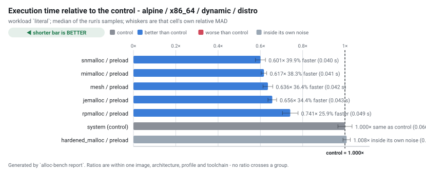
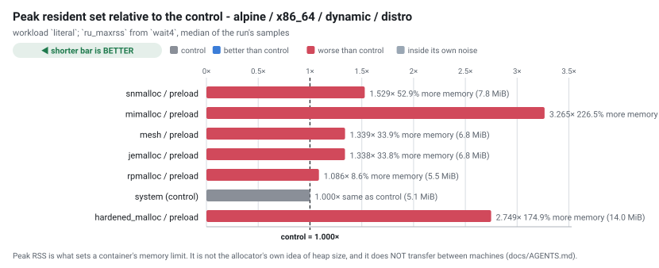
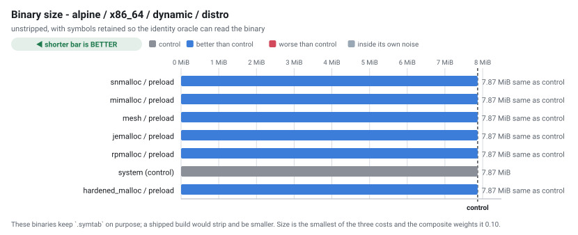
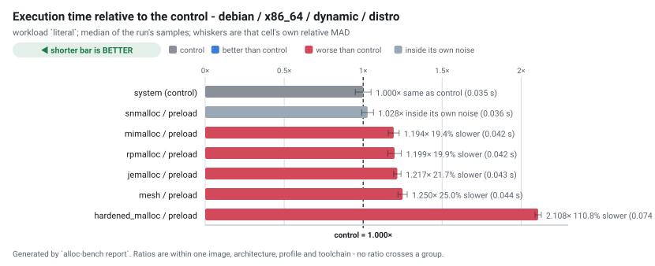
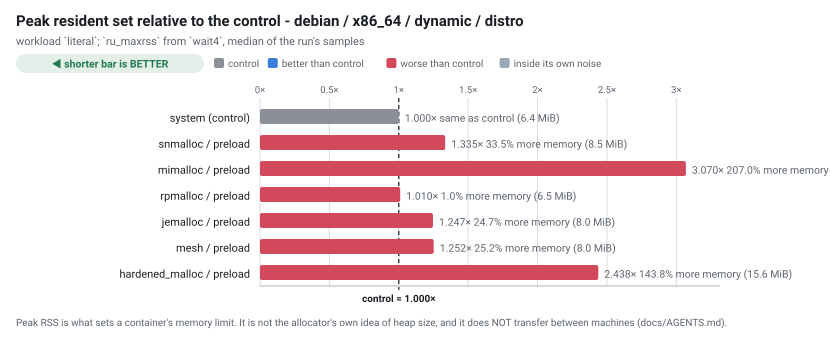
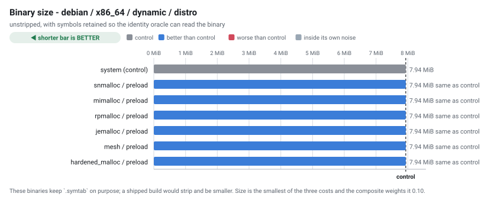

# Allocator benchmark - run `20260903-003445`

Generated by `alloc-bench report`.  Do not edit: it is overwritten from the dataset in `results/`.

## What this run does not establish

Read this before the tables. It is not a disclaimer; it is the list of questions these numbers cannot answer.

| | |
| --- | --- |
| **one machine, one day** | `Intel(R) Xeon(R) Processor @ 2.80GHz`, 4 × `x86_64`, 16075 MiB RAM, kernel `Linux 6.18.44-fc-v24`. Absolute timings here do not transfer to other hardware. Ratios within a group are the transferable part, and even those are measured, not guaranteed. |
| **cells that could not exist** | 2 configuration(s) are unsupported, each with a recorded technical reason. They are listed below rather than dropped. |
| **cells that failed** | 0 configuration(s) were attempted and did not produce a usable result. Also listed below. |
| **noise** | 21 cell(s) measured a relative MAD above the 5% threshold. Differences smaller than that cell's own spread are not attributable to the allocator. |
| **what an allocator is good at generally** | this measures one application (ripgrep) on one corpus shape. ripgrep is not allocation-bound; an allocation-heavy service would rank differently, and nothing here says otherwise. |
| **security** | hardened_malloc trades performance for memory-safety mitigations. A slower row for it is the expected cost of what it does, not a defect, and this project makes no claim about whether those mitigations work. |

## Conditions

| | |
| --- | --- |
| run id | `20260903-003445` |
| started | 2026-09-03T00:34:45Z |
| suites | preload |
| repository commit | `b5baa3a9e4d7a137483d4065abd584a82a80e613` |
| corpus seed | `20260901` |
| container runtime | docker 29.3.1 |
| primary workload | `literal` |

### Exactly what produced these numbers

| component | ref | commit |
| --- | --- | --- |
| `hardened_malloc` | release `14` | [`1d7fc7ffe0f8`](https://github.com/GrapheneOS/hardened_malloc/commit/1d7fc7ffe0f8068a32ab2ba33df7515e7bad3f5f) |
| `jemalloc` | release `5.3.1` | [`81034ce1f137`](https://github.com/jemalloc/jemalloc/commit/81034ce1f1373e37dc865038e1bc8eeecf559ce8) |
| `mesh` | branch `master` | [`2987f883b869`](https://github.com/plasma-umass/mesh/commit/2987f883b8695c07a80dc40da67c61f524460dfd) |
| `mimalloc` | release `v3.5.0` | [`18b08671c930`](https://github.com/microsoft/mimalloc/commit/18b08671c9302247bfb682286e6bf3cc1773f801) |
| `ripgrep` | release `15.2.0` | [`e89fff89ac9a`](https://github.com/BurntSushi/ripgrep/commit/e89fff89ac9af12e8d4ce9d5fd07beb408ca730f) |
| `rpmalloc` | release `2.0.1` | [`beef233c176b`](https://github.com/mjansson/rpmalloc/commit/beef233c176b235587c0145f765e4316e5ca60d1) |
| `snmalloc` | release `0.7.5` | [`526c55bdffa1`](https://github.com/microsoft/snmalloc/commit/526c55bdffa17aae20a9a3d24fe68a7a3b8d9894) |
| `tcmalloc` | branch `master` | [`897c9eaf5d31`](https://github.com/google/tcmalloc/commit/897c9eaf5d31a94ca9983782de5d6c3c347e609e) |

## Rankings

Ordered by median execution time on `literal`, fastest first. `rel` is the ratio against the control in the SAME image, architecture, profile and toolchain - no ratio crosses a group. `MAD` is the relative median absolute deviation of that cell's own samples: **a difference smaller than the MAD is not a result**.

**How to read it.** Every measured column is one where **lower is better**, marked `↓` in the header: less time, less memory, a smaller binary and a tighter spread are all the good direction. A `rel` under `1.000×` beat the control and one over it lost.

| marker | meaning |
| --- | --- |
| `↓` in a header | lower is better for this column |
| `≈ control` |  this row's distance from the control is **smaller than its own MAD**, so this run does not establish that it is faster or slower. §9's rule, applied per row. |
| `–` | not measured.  Never a zero, and never a blank that could be read as one. |

Composite, where shown: `composite = 0.60 x (time / baseline_time) + 0.30 x (peak_rss / baseline_peak_rss) + 0.10 x (binary_bytes / baseline_binary_bytes); lower is better, 1.000 is the control` - also **lower is better**, and every component is published separately so a reader who weighs them differently can re-rank.

### alpine / x86_64 / dynamic / distro

| # | allocator | mechanism | time (s) ↓ | vs control ↓ | MAD ↓ | peak RSS (MiB) ↓ | vs control ↓ | size (MiB) ↓ | startup (s) ↓ | composite ↓ |
| --- | --- | --- | --- | --- | --- | --- | --- | --- | --- | --- |
| 1 | snmalloc | `preload` | 0.040 | 0.601× (39.9% faster) | 3.9% | 7.783 | 1.529× (52.9% more) | 7.87 | 0.002 | 0.919 |
| 2 | mimalloc | `preload` | 0.041 | 0.617× (38.3% faster) | 2.1% | 16.627 | 3.265× (226.5% more) | 7.87 | 0.003 | 1.450 |
| 3 | mesh | `preload` | 0.042 | 0.636× (36.4% faster) | 3.6% | 6.816 | 1.339× (33.9% more) | 7.87 | 0.002 | 0.883 |
| 4 | jemalloc | `preload` | 0.043 | 0.656× (34.4% faster) | 3.1% | 6.812 | 1.338× (33.8% more) | 7.87 | 0.002 | 0.895 |
| 5 | rpmalloc | `preload` | 0.049 | 0.741× (25.9% faster) | 5.0% | 5.531 | 1.086× (8.6% more) | 7.87 | 0.002 | 0.871 |
| 6 | system *(control)* | `baseline` | 0.066 | 1.000× *(control)* | 3.3% | 5.092 | 1.000× *(control)* | 7.87 | 0.002 | 1.000 |
| 7 | hardened_malloc | `preload` | 0.067 | 1.008×  ≈ control | 1.7% | 13.998 | 2.749× (174.9% more) | 7.87 | 0.005 | 1.529 |

>  **No winner is claimed here.** the lead of 2.7% is within this run's own spread (3.9% relative MAD), so the ordering between the top rows is not established here

### debian / x86_64 / dynamic / distro

| # | allocator | mechanism | time (s) ↓ | vs control ↓ | MAD ↓ | peak RSS (MiB) ↓ | vs control ↓ | size (MiB) ↓ | startup (s) ↓ | composite ↓ |
| --- | --- | --- | --- | --- | --- | --- | --- | --- | --- | --- |
| 1 | system *(control)* | `baseline` | 0.035 | 1.000× *(control)* | 5.0% | 6.393 | 1.000× *(control)* | 7.94 | 0.003 | 1.000 |
| 2 | snmalloc | `preload` | 0.036 | 1.028×  ≈ control | 3.6% | 8.533 | 1.335× (33.5% more) | 7.94 | 0.003 | 1.117 |
| 3 | mimalloc | `preload` | 0.042 | 1.194× (19.4% slower) | 2.9% | 19.623 | 3.070× (207.0% more) | 7.94 | 0.004 | 1.737 |
| 4 | rpmalloc | `preload` | 0.042 | 1.199× (19.9% slower) | 3.6% | 6.459 | 1.010× (1.0% more) | 7.94 | 0.003 | 1.122 |
| 5 | jemalloc | `preload` | 0.043 | 1.217× (21.7% slower) | 1.9% | 7.973 | 1.247× (24.7% more) | 7.94 | 0.003 | 1.204 |
| 6 | mesh | `preload` | 0.044 | 1.250× (25.0% slower) | 2.3% | 8.002 | 1.252× (25.2% more) | 7.94 | 0.003 | 1.225 |
| 7 | hardened_malloc | `preload` | 0.074 | 2.108× (110.8% slower) | 0.9% | 15.584 | 2.438× (143.8% more) | 7.94 | 0.006 | 2.096 |

>  **No winner is claimed here.** the lead of 2.8% is within this run's own spread (5.0% relative MAD), so the ordering between the top rows is not established here

## Every workload

The ranking above uses one workload. These are all of them, as median seconds, so a reader can see whether the ordering holds or whether it is an artefact of one shape of work.

| cell | files | json | literal | literal-j1 | nomatch | regex | startup |
| --- | --- | --- | --- | --- | --- | --- | --- |
| `alpine-x86_64-hardened_malloc-preload-dynamic-distro` | 0.065 | 0.072 | 0.067 | 0.122 | 0.050 | 0.069 | 0.005 |
| `alpine-x86_64-jemalloc-preload-dynamic-distro` | 0.038 | 0.040 | 0.043 | 0.110 | 0.029 | 0.042 | 0.002 |
| `alpine-x86_64-mesh-preload-dynamic-distro` | 0.039 | 0.038 | 0.042 | 0.095 | 0.026 | 0.043 | 0.002 |
| `alpine-x86_64-mimalloc-preload-dynamic-distro` | 0.038 | 0.039 | 0.041 | 0.108 | 0.026 | 0.043 | 0.003 |
| `alpine-x86_64-rpmalloc-preload-dynamic-distro` | 0.034 | 0.034 | 0.049 | 0.106 | 0.026 | 0.038 | 0.002 |
| `alpine-x86_64-snmalloc-preload-dynamic-distro` | 0.035 | 0.035 | 0.040 | 0.121 | 0.026 | 0.040 | 0.002 |
| `alpine-x86_64-system-baseline-dynamic-distro` | 0.066 | 0.058 | 0.066 | 0.111 | 0.047 | 0.070 | 0.002 |
| `debian-x86_64-hardened_malloc-preload-dynamic-distro` | 0.065 | 0.061 | 0.074 | 0.125 | 0.052 | 0.074 | 0.006 |
| `debian-x86_64-jemalloc-preload-dynamic-distro` | 0.041 | 0.039 | 0.043 | 0.103 | 0.028 | 0.046 | 0.003 |
| `debian-x86_64-mesh-preload-dynamic-distro` | 0.040 | 0.037 | 0.044 | 0.097 | 0.029 | 0.045 | 0.003 |
| `debian-x86_64-mimalloc-preload-dynamic-distro` | 0.038 | 0.037 | 0.042 | 0.104 | 0.028 | 0.043 | 0.004 |
| `debian-x86_64-rpmalloc-preload-dynamic-distro` | 0.038 | 0.037 | 0.042 | 0.099 | 0.027 | 0.042 | 0.003 |
| `debian-x86_64-snmalloc-preload-dynamic-distro` | 0.040 | 0.036 | 0.036 | 0.106 | 0.027 | 0.045 | 0.003 |
| `debian-x86_64-system-baseline-dynamic-distro` | 0.031 | 0.030 | 0.035 | 0.094 | 0.022 | 0.034 | 0.003 |

## Address-space randomisation, observed

Read from `/proc/<pid>/maps` while each binary was running, not inferred from the ELF type. A static non-PIE executable is loaded at a fixed address; a static PIE is not.

 **In this table higher is better**, unlike every table above it: `6 of 6` distinct load addresses is randomisation working, and `1 of 6` is a binary that lands at the same address every time.

| cell | profile | link kind | distinct load addresses ↑ | randomised |
| --- | --- | --- | --- | --- |
| `alpine-x86_64-hardened_malloc-preload-dynamic-distro` | dynamic | dynamic | 6 of 6 | true |
| `alpine-x86_64-jemalloc-preload-dynamic-distro` | dynamic | dynamic | 6 of 6 | true |
| `alpine-x86_64-mesh-preload-dynamic-distro` | dynamic | dynamic | 6 of 6 | true |
| `alpine-x86_64-mimalloc-preload-dynamic-distro` | dynamic | dynamic | 6 of 6 | true |
| `alpine-x86_64-rpmalloc-preload-dynamic-distro` | dynamic | dynamic | 6 of 6 | true |
| `alpine-x86_64-snmalloc-preload-dynamic-distro` | dynamic | dynamic | 6 of 6 | true |
| `alpine-x86_64-system-baseline-dynamic-distro` | dynamic | dynamic | 6 of 6 | true |
| `debian-x86_64-hardened_malloc-preload-dynamic-distro` | dynamic | dynamic | 6 of 6 | true |
| `debian-x86_64-jemalloc-preload-dynamic-distro` | dynamic | dynamic | 6 of 6 | true |
| `debian-x86_64-mesh-preload-dynamic-distro` | dynamic | dynamic | 6 of 6 | true |
| `debian-x86_64-mimalloc-preload-dynamic-distro` | dynamic | dynamic | 6 of 6 | true |
| `debian-x86_64-rpmalloc-preload-dynamic-distro` | dynamic | dynamic | 6 of 6 | true |
| `debian-x86_64-snmalloc-preload-dynamic-distro` | dynamic | dynamic | 6 of 6 | true |
| `debian-x86_64-system-baseline-dynamic-distro` | dynamic | dynamic | 6 of 6 | true |

## Preloaded libraries, observed resident

 A preload cell's allocator is **not in its binary**, so the ELF oracle that identifies every other mechanism has nothing to read. These rows are read from `/proc/<pid>/maps` of the running subject: mapped with `LD_PRELOAD` set, and absent without it.  The empty control is what makes the positive mean anything.

 **The two columns are read in opposite directions.** For `mapped with LD_PRELOAD`, higher is better - every sample should find the library. For `mapped without`, **lower is better** and the only passing value is **0**.

| cell | allocator | mapped with LD_PRELOAD ↑ | mapped without (control) ↓ |
| --- | --- | --- | --- |
| `alpine-x86_64-hardened_malloc-preload-dynamic-distro` | hardened_malloc | 4 of 4 sampled | 0 of 4 sampled |
| `alpine-x86_64-jemalloc-preload-dynamic-distro` | jemalloc | 4 of 4 sampled | 0 of 4 sampled |
| `alpine-x86_64-mesh-preload-dynamic-distro` | mesh | 4 of 4 sampled | 0 of 4 sampled |
| `alpine-x86_64-mimalloc-preload-dynamic-distro` | mimalloc | 4 of 4 sampled | 0 of 4 sampled |
| `alpine-x86_64-rpmalloc-preload-dynamic-distro` | rpmalloc | 4 of 4 sampled | 0 of 4 sampled |
| `alpine-x86_64-snmalloc-preload-dynamic-distro` | snmalloc | 4 of 4 sampled | 0 of 4 sampled |
| `debian-x86_64-hardened_malloc-preload-dynamic-distro` | hardened_malloc | 4 of 4 sampled | 0 of 4 sampled |
| `debian-x86_64-jemalloc-preload-dynamic-distro` | jemalloc | 4 of 4 sampled | 0 of 4 sampled |
| `debian-x86_64-mesh-preload-dynamic-distro` | mesh | 4 of 4 sampled | 0 of 4 sampled |
| `debian-x86_64-mimalloc-preload-dynamic-distro` | mimalloc | 4 of 4 sampled | 0 of 4 sampled |
| `debian-x86_64-rpmalloc-preload-dynamic-distro` | rpmalloc | 4 of 4 sampled | 0 of 4 sampled |
| `debian-x86_64-snmalloc-preload-dynamic-distro` | snmalloc | 4 of 4 sampled | 0 of 4 sampled |

## Configurations that could not exist

 These are results. Each names a concrete technical reason, and a future upstream release that removes the reason turns the row into a measurement without anyone editing prose.

| cell | reason |
| --- | --- |
| `alpine-x86_64-tcmalloc-preload-dynamic-distro` | upstream does not support musl; the Bazel build requires glibc-specific interfaces. |
| `debian-x86_64-tcmalloc-preload-dynamic-distro` | bazel could not fetch its module registry: the JVM rejected the TLS certificate for bcr.bazel.build (PKIX path building failed). bazelisk downloads its own JDK, whose trust store is not /etc/ssl/certs/ca-certificates.crt, so an extra CA trusted by the image is invisible to it. This is a property of this network, NOT of tcmalloc or of Bazel 8.6.0. On an unproxied host the build proceeds; here it needs a JDK in the image and the CA in that JDK's cacerts. |

## Configurations that failed

None in this run.

## Validation

`alloc-bench validate` checks the dataset before this report is written. An `ERROR` means the ranking above must not be trusted; the exit status reflects it.

| severity | check | cell | message |
| --- | --- | --- | --- |
| warn | `noisy` | `alpine-x86_64-hardened_malloc-preload-dynamic-distro` | workload literal-j1 has a relative MAD of 13.3%, above the 5% threshold; differences smaller than that cannot be attributed to the allocator on this host |
| warn | `noisy` | `alpine-x86_64-hardened_malloc-preload-dynamic-distro` | workload startup has a relative MAD of 16.1%, above the 5% threshold; differences smaller than that cannot be attributed to the allocator on this host |
| warn | `noisy` | `alpine-x86_64-jemalloc-preload-dynamic-distro` | workload nomatch has a relative MAD of 8.1%, above the 5% threshold; differences smaller than that cannot be attributed to the allocator on this host |
| warn | `noisy` | `alpine-x86_64-mimalloc-preload-dynamic-distro` | workload json has a relative MAD of 5.2%, above the 5% threshold; differences smaller than that cannot be attributed to the allocator on this host |
| warn | `noisy` | `alpine-x86_64-mimalloc-preload-dynamic-distro` | workload regex has a relative MAD of 5.7%, above the 5% threshold; differences smaller than that cannot be attributed to the allocator on this host |
| warn | `noisy` | `alpine-x86_64-mimalloc-preload-dynamic-distro` | workload startup has a relative MAD of 12.4%, above the 5% threshold; differences smaller than that cannot be attributed to the allocator on this host |
| warn | `noisy` | `alpine-x86_64-snmalloc-preload-dynamic-distro` | workload files has a relative MAD of 6.9%, above the 5% threshold; differences smaller than that cannot be attributed to the allocator on this host |
| warn | `noisy` | `alpine-x86_64-snmalloc-preload-dynamic-distro` | workload literal-j1 has a relative MAD of 7.7%, above the 5% threshold; differences smaller than that cannot be attributed to the allocator on this host |
| warn | `noisy` | `alpine-x86_64-snmalloc-preload-dynamic-distro` | workload nomatch has a relative MAD of 8.1%, above the 5% threshold; differences smaller than that cannot be attributed to the allocator on this host |
| warn | `noisy` | `alpine-x86_64-snmalloc-preload-dynamic-distro` | workload startup has a relative MAD of 8.7%, above the 5% threshold; differences smaller than that cannot be attributed to the allocator on this host |
| warn | `noisy` | `alpine-x86_64-system-baseline-dynamic-distro` | workload files has a relative MAD of 6.6%, above the 5% threshold; differences smaller than that cannot be attributed to the allocator on this host |
| warn | `noisy` | `alpine-x86_64-system-baseline-dynamic-distro` | workload nomatch has a relative MAD of 7.3%, above the 5% threshold; differences smaller than that cannot be attributed to the allocator on this host |
| warn | `noisy` | `debian-x86_64-hardened_malloc-preload-dynamic-distro` | workload files has a relative MAD of 6.6%, above the 5% threshold; differences smaller than that cannot be attributed to the allocator on this host |
| warn | `noisy` | `debian-x86_64-hardened_malloc-preload-dynamic-distro` | workload literal-j1 has a relative MAD of 6.3%, above the 5% threshold; differences smaller than that cannot be attributed to the allocator on this host |
| warn | `noisy` | `debian-x86_64-hardened_malloc-preload-dynamic-distro` | workload startup has a relative MAD of 5.6%, above the 5% threshold; differences smaller than that cannot be attributed to the allocator on this host |
| warn | `noisy` | `debian-x86_64-jemalloc-preload-dynamic-distro` | workload regex has a relative MAD of 6.9%, above the 5% threshold; differences smaller than that cannot be attributed to the allocator on this host |
| warn | `noisy` | `debian-x86_64-mimalloc-preload-dynamic-distro` | workload startup has a relative MAD of 10.8%, above the 5% threshold; differences smaller than that cannot be attributed to the allocator on this host |
| warn | `noisy` | `debian-x86_64-snmalloc-preload-dynamic-distro` | workload literal-j1 has a relative MAD of 5.4%, above the 5% threshold; differences smaller than that cannot be attributed to the allocator on this host |
| warn | `noisy` | `debian-x86_64-snmalloc-preload-dynamic-distro` | workload regex has a relative MAD of 5.2%, above the 5% threshold; differences smaller than that cannot be attributed to the allocator on this host |
| warn | `noisy` | `debian-x86_64-snmalloc-preload-dynamic-distro` | workload startup has a relative MAD of 5.9%, above the 5% threshold; differences smaller than that cannot be attributed to the allocator on this host |
| warn | `noisy` | `debian-x86_64-system-baseline-dynamic-distro` | workload literal has a relative MAD of 5.0%, above the 5% threshold; differences smaller than that cannot be attributed to the allocator on this host |

---

16 cell(s) planned, 14 produced a usable result, 2 unsupported, 0 failed.

Raw samples, build metadata, identity evidence and correctness output for every cell are in `results/` and `cells/` beside this file.  Every number above is derived from them; none was typed in.
