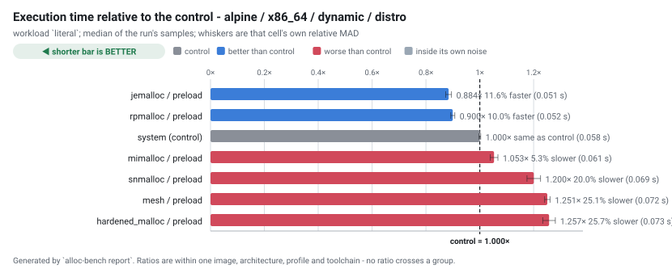
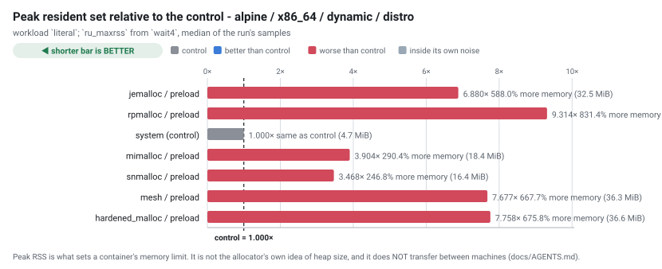
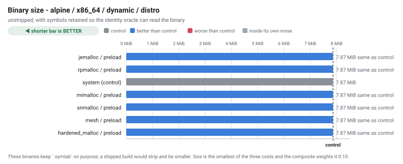
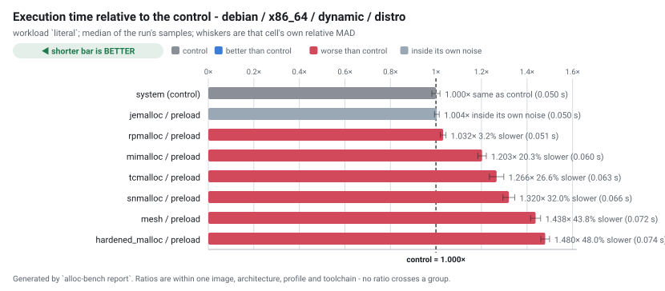
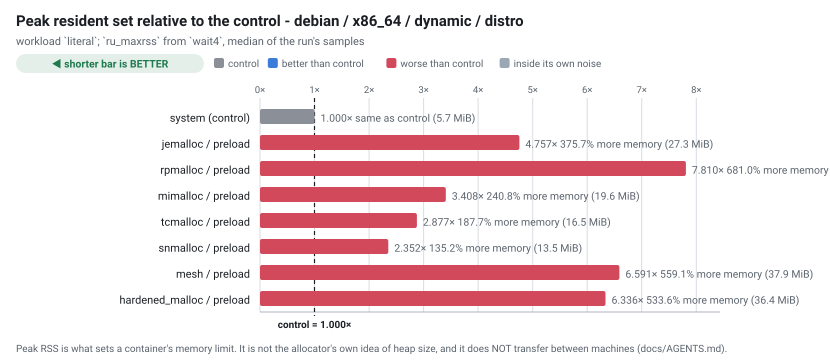
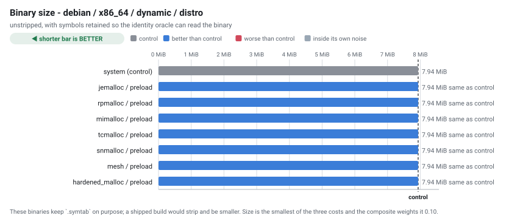

# Allocator benchmark - run `20260903-074750`

Generated by `alloc-bench report`.  Do not edit: it is overwritten from the dataset in `results/`.

## What this run does not establish

Read this before the tables. It is not a disclaimer; it is the list of questions these numbers cannot answer.

| | |
| --- | --- |
| **one machine, one day** | `AMD EPYC 9V74 80-Core Processor`, 4 × `x86_64`, 15989 MiB RAM, kernel `Linux 6.17.0-1022-azure`. Absolute timings here do not transfer to other hardware. Ratios within a group are the transferable part, and even those are measured, not guaranteed. |
| **cells that could not exist** | 1 configuration(s) are unsupported, each with a recorded technical reason. They are listed below rather than dropped. |
| **cells that failed** | 0 configuration(s) were attempted and did not produce a usable result. Also listed below. |
| **noise** | 6 cell(s) measured a relative MAD above the 5% threshold. Differences smaller than that cell's own spread are not attributable to the allocator. |
| **what an allocator is good at generally** | this measures one application (ripgrep) on one corpus shape. ripgrep is not allocation-bound; an allocation-heavy service would rank differently, and nothing here says otherwise. |
| **security** | hardened_malloc trades performance for memory-safety mitigations. A slower row for it is the expected cost of what it does, not a defect, and this project makes no claim about whether those mitigations work. |

## Conditions

| | |
| --- | --- |
| run id | `20260903-074750` |
| started | 2026-09-03T07:47:50Z |
| suites | preload |
| repository commit | `c13689af1894bea6aeacec96fdfc7b1e78559afc` |
| corpus seed | `20260901` |
| container runtime | docker 28.0.4 |
| primary workload | `literal` |
| GITHUB_REF | `refs/heads/main` |
| GITHUB_REPOSITORY | `Azathothas/alloc-bench` |
| GITHUB_RUN_ATTEMPT | `1` |
| GITHUB_RUN_ID | `33729832142` |
| GITHUB_RUN_NUMBER | `13` |
| GITHUB_SHA | `c13689af1894bea6aeacec96fdfc7b1e78559afc` |
| GITHUB_WORKFLOW | `bench` |
| ImageOS | `ubuntu24` |
| ImageVersion | `20260831.293.1` |
| RUNNER_ARCH | `X64` |
| RUNNER_NAME | `GitHub Actions 1000010729` |
| RUNNER_OS | `Linux` |

### Exactly what produced these numbers

| component | ref | commit |
| --- | --- | --- |
| `hardened_malloc` | release `14` | [`1d7fc7ffe0f8`](https://github.com/GrapheneOS/hardened_malloc/commit/1d7fc7ffe0f8068a32ab2ba33df7515e7bad3f5f) |
| `jemalloc` | release `5.3.1` | [`81034ce1f137`](https://github.com/jemalloc/jemalloc/commit/81034ce1f1373e37dc865038e1bc8eeecf559ce8) |
| `mesh` | branch `master` | [`2987f883b869`](https://github.com/plasma-umass/mesh/commit/2987f883b8695c07a80dc40da67c61f524460dfd) |
| `mimalloc` | release `v3.5.0` | [`18b08671c930`](https://github.com/microsoft/mimalloc/commit/18b08671c9302247bfb682286e6bf3cc1773f801) |
| `ripgrep` | release `15.2.0` | [`e89fff89ac9a`](https://github.com/BurntSushi/ripgrep/commit/e89fff89ac9af12e8d4ce9d5fd07beb408ca730f) |
| `rpmalloc` | release `2.0.1` | [`beef233c176b`](https://github.com/mjansson/rpmalloc/commit/beef233c176b235587c0145f765e4316e5ca60d1) |
| `snmalloc` | release `0.7.5` | [`526c55bdffa1`](https://github.com/microsoft/snmalloc/commit/526c55bdffa17aae20a9a3d24fe68a7a3b8d9894) |
| `tcmalloc` | branch `master` | [`897c9eaf5d31`](https://github.com/google/tcmalloc/commit/897c9eaf5d31a94ca9983782de5d6c3c347e609e) |

## Rankings

 **Every ordering below is a statement about one machine - AMD EPYC 9V74 80-Core Processor (4 core(s)), `Linux 6.17.0-1022-azure`.** The same six cells have produced three different orderings on three CPUs, and the run that inverted the result reported the *tightest* spread of the three. Never quote a row from this table without naming this machine; `results/rolling/` is where a claim about more than one lives.

Ordered by median execution time on `literal`, fastest first. `rel` is the ratio against the control in the SAME image, architecture, profile and toolchain - no ratio crosses a group. `MAD` is the relative median absolute deviation of that cell's own samples: **a difference smaller than the MAD is not a result**.

**How to read it.** Every measured column is one where **lower is better**, marked `↓` in the header: less time, less memory, a smaller binary and a tighter spread are all the good direction. A `rel` under `1.000×` beat the control and one over it lost.

| marker | meaning |
| --- | --- |
| `↓` in a header | lower is better for this column |
| `≈ control` |  this row's distance from the control is **smaller than its own MAD**, so this run does not establish that it is faster or slower. §9's rule, applied per row. |
| `–` | not measured.  Never a zero, and never a blank that could be read as one. |

Composite, where shown: `composite = 0.60 x (time / baseline_time) + 0.30 x (peak_rss / baseline_peak_rss) + 0.10 x (binary_bytes / baseline_binary_bytes); lower is better, 1.000 is the control` - also **lower is better**, and every component is published separately so a reader who weighs them differently can re-rank.

### alpine / x86_64 / dynamic / distro

| # | allocator | mechanism | time (s) ↓ | vs control ↓ | MAD ↓ | peak RSS (MiB) ↓ | vs control ↓ | size (MiB) ↓ | startup (s) ↓ | composite ↓ |
| --- | --- | --- | --- | --- | --- | --- | --- | --- | --- | --- |
| 1 | jemalloc | `preload` | 0.051 | 0.884× (11.6% faster) | 1.2% | 32.490 | 6.880× (588.0% more) | 7.87 | 0.002 | 2.694 |
| 2 | rpmalloc | `preload` | 0.052 | 0.900× (10.0% faster) | 0.8% | 43.988 | 9.314× (831.4% more) | 7.87 | 0.002 | 3.434 |
| 3 | system *(control)* | `baseline` | 0.058 | 1.000× *(control)* | 0.3% | 4.723 | 1.000× *(control)* | 7.87 | 0.002 | 1.000 |
| 4 | mimalloc | `preload` | 0.061 | 1.053× (5.3% slower) | 1.4% | 18.439 | 3.904× (290.4% more) | 7.87 | 0.002 | 1.903 |
| 5 | snmalloc | `preload` | 0.069 | 1.200× (20.0% slower) | 2.1% | 16.379 | 3.468× (246.8% more) | 7.87 | 0.002 | 1.861 |
| 6 | mesh | `preload` | 0.072 | 1.251× (25.1% slower) | 0.8% | 36.258 | 7.677× (667.7% more) | 7.87 | 0.003 | 3.154 |
| 7 | hardened_malloc | `preload` | 0.073 | 1.257× (25.7% slower) | 1.9% | 36.641 | 7.758× (675.8% more) | 7.87 | 0.005 | 3.182 |

> **Fastest: jemalloc (preload).** jemalloc is 1.7% faster than the next row, which is outside the run's spread of 1.2%

### debian / x86_64 / dynamic / distro

| # | allocator | mechanism | time (s) ↓ | vs control ↓ | MAD ↓ | peak RSS (MiB) ↓ | vs control ↓ | size (MiB) ↓ | startup (s) ↓ | composite ↓ |
| --- | --- | --- | --- | --- | --- | --- | --- | --- | --- | --- |
| 1 | system *(control)* | `baseline` | 0.050 | 1.000× *(control)* | 1.8% | 5.746 | 1.000× *(control)* | 7.94 | 0.002 | 1.000 |
| 2 | jemalloc | `preload` | 0.050 | 1.004×  ≈ control | 1.0% | 27.332 | 4.757× (375.7% more) | 7.94 | 0.002 | 2.129 |
| 3 | rpmalloc | `preload` | 0.051 | 1.032× (3.2% slower) | 1.2% | 44.879 | 7.810× (681.0% more) | 7.94 | 0.002 | 3.062 |
| 4 | mimalloc | `preload` | 0.060 | 1.203× (20.3% slower) | 1.5% | 19.582 | 3.408× (240.8% more) | 7.94 | 0.002 | 1.844 |
| 5 | tcmalloc | `preload` | 0.063 | 1.266× (26.6% slower) | 2.5% | 16.529 | 2.877× (187.7% more) | 7.94 | 0.008 | 1.723 |
| 6 | snmalloc | `preload` | 0.066 | 1.320× (32.0% slower) | 2.0% | 13.518 | 2.352× (135.2% more) | 7.94 | 0.002 | 1.598 |
| 7 | mesh | `preload` | 0.072 | 1.438× (43.8% slower) | 1.5% | 37.873 | 6.591× (559.1% more) | 7.94 | 0.003 | 2.940 |
| 8 | hardened_malloc | `preload` | 0.074 | 1.480× (48.0% slower) | 1.3% | 36.406 | 6.336× (533.6% more) | 7.94 | 0.006 | 2.889 |

>  **No winner is claimed here.** the lead of 0.4% is within this run's own spread (1.8% relative MAD), so the ordering between the top rows is not established here

## Every workload

The ranking above uses one workload. These are all of them, as median seconds, so a reader can see whether the ordering holds or whether it is an artefact of one shape of work.

| cell | files | json | literal | literal-j1 | nomatch | regex | startup |
| --- | --- | --- | --- | --- | --- | --- | --- |
| `alpine-x86_64-hardened_malloc-preload-dynamic-distro` | 0.069 | 0.065 | 0.073 | 0.156 | 0.052 | 0.076 | 0.005 |
| `alpine-x86_64-jemalloc-preload-dynamic-distro` | 0.047 | 0.043 | 0.051 | 0.144 | 0.032 | 0.053 | 0.002 |
| `alpine-x86_64-mesh-preload-dynamic-distro` | 0.066 | 0.061 | 0.072 | 0.153 | 0.045 | 0.074 | 0.003 |
| `alpine-x86_64-mimalloc-preload-dynamic-distro` | 0.057 | 0.053 | 0.061 | 0.149 | 0.042 | 0.063 | 0.002 |
| `alpine-x86_64-rpmalloc-preload-dynamic-distro` | 0.048 | 0.044 | 0.052 | 0.144 | 0.033 | 0.054 | 0.002 |
| `alpine-x86_64-snmalloc-preload-dynamic-distro` | 0.067 | 0.061 | 0.069 | 0.147 | 0.042 | 0.069 | 0.002 |
| `alpine-x86_64-system-baseline-dynamic-distro` | 0.054 | 0.050 | 0.058 | 0.146 | 0.037 | 0.061 | 0.002 |
| `debian-x86_64-hardened_malloc-preload-dynamic-distro` | 0.071 | 0.064 | 0.074 | 0.156 | 0.052 | 0.076 | 0.006 |
| `debian-x86_64-jemalloc-preload-dynamic-distro` | 0.046 | 0.042 | 0.050 | 0.141 | 0.031 | 0.051 | 0.002 |
| `debian-x86_64-mesh-preload-dynamic-distro` | 0.064 | 0.057 | 0.072 | 0.150 | 0.043 | 0.074 | 0.003 |
| `debian-x86_64-mimalloc-preload-dynamic-distro` | 0.056 | 0.051 | 0.060 | 0.142 | 0.039 | 0.062 | 0.002 |
| `debian-x86_64-rpmalloc-preload-dynamic-distro` | 0.047 | 0.041 | 0.051 | 0.140 | 0.032 | 0.053 | 0.002 |
| `debian-x86_64-snmalloc-preload-dynamic-distro` | 0.062 | 0.054 | 0.066 | 0.140 | 0.041 | 0.068 | 0.002 |
| `debian-x86_64-system-baseline-dynamic-distro` | 0.046 | 0.041 | 0.050 | 0.140 | 0.031 | 0.051 | 0.002 |
| `debian-x86_64-tcmalloc-preload-dynamic-distro` | 0.060 | 0.054 | 0.063 | 0.148 | 0.043 | 0.065 | 0.008 |

## Address-space randomisation, observed

Read from `/proc/<pid>/maps` while each binary was running, not inferred from the ELF type. A static non-PIE executable is loaded at a fixed address; a static PIE is not.

 **In this table higher is better**, unlike every table above it: `6 of 6` distinct load addresses is randomisation working, and `1 of 6` is a binary that lands at the same address every time.

| cell | profile | link kind | distinct load addresses ↑ | randomised |
| --- | --- | --- | --- | --- |
| `alpine-x86_64-hardened_malloc-preload-dynamic-distro` | dynamic | dynamic | 6 of 6 | true |
| `alpine-x86_64-jemalloc-preload-dynamic-distro` | dynamic | dynamic | 6 of 6 | true |
| `alpine-x86_64-mesh-preload-dynamic-distro` | dynamic | dynamic | 6 of 6 | true |
| `alpine-x86_64-mimalloc-preload-dynamic-distro` | dynamic | dynamic | 6 of 6 | true |
| `alpine-x86_64-rpmalloc-preload-dynamic-distro` | dynamic | dynamic | 6 of 6 | true |
| `alpine-x86_64-snmalloc-preload-dynamic-distro` | dynamic | dynamic | 6 of 6 | true |
| `alpine-x86_64-system-baseline-dynamic-distro` | dynamic | dynamic | 6 of 6 | true |
| `debian-x86_64-hardened_malloc-preload-dynamic-distro` | dynamic | dynamic | 6 of 6 | true |
| `debian-x86_64-jemalloc-preload-dynamic-distro` | dynamic | dynamic | 6 of 6 | true |
| `debian-x86_64-mesh-preload-dynamic-distro` | dynamic | dynamic | 6 of 6 | true |
| `debian-x86_64-mimalloc-preload-dynamic-distro` | dynamic | dynamic | 6 of 6 | true |
| `debian-x86_64-rpmalloc-preload-dynamic-distro` | dynamic | dynamic | 6 of 6 | true |
| `debian-x86_64-snmalloc-preload-dynamic-distro` | dynamic | dynamic | 6 of 6 | true |
| `debian-x86_64-system-baseline-dynamic-distro` | dynamic | dynamic | 6 of 6 | true |
| `debian-x86_64-tcmalloc-preload-dynamic-distro` | dynamic | dynamic | 6 of 6 | true |

## Preloaded libraries, observed resident

 A preload cell's allocator is **not in its binary**, so the ELF oracle that identifies every other mechanism has nothing to read. These rows are read from `/proc/<pid>/maps` of the running subject: mapped with `LD_PRELOAD` set, and absent without it.  The empty control is what makes the positive mean anything.

 **The two columns are read in opposite directions.** For `mapped with LD_PRELOAD`, higher is better - every sample should find the library. For `mapped without`, **lower is better** and the only passing value is **0**.

| cell | allocator | mapped with LD_PRELOAD ↑ | mapped without (control) ↓ |
| --- | --- | --- | --- |
| `alpine-x86_64-hardened_malloc-preload-dynamic-distro` | hardened_malloc | 4 of 4 sampled | 0 of 4 sampled |
| `alpine-x86_64-jemalloc-preload-dynamic-distro` | jemalloc | 4 of 4 sampled | 0 of 4 sampled |
| `alpine-x86_64-mesh-preload-dynamic-distro` | mesh | 4 of 4 sampled | 0 of 4 sampled |
| `alpine-x86_64-mimalloc-preload-dynamic-distro` | mimalloc | 4 of 4 sampled | 0 of 4 sampled |
| `alpine-x86_64-rpmalloc-preload-dynamic-distro` | rpmalloc | 4 of 4 sampled | 0 of 4 sampled |
| `alpine-x86_64-snmalloc-preload-dynamic-distro` | snmalloc | 4 of 4 sampled | 0 of 4 sampled |
| `debian-x86_64-hardened_malloc-preload-dynamic-distro` | hardened_malloc | 4 of 4 sampled | 0 of 4 sampled |
| `debian-x86_64-jemalloc-preload-dynamic-distro` | jemalloc | 4 of 4 sampled | 0 of 4 sampled |
| `debian-x86_64-mesh-preload-dynamic-distro` | mesh | 4 of 4 sampled | 0 of 4 sampled |
| `debian-x86_64-mimalloc-preload-dynamic-distro` | mimalloc | 4 of 4 sampled | 0 of 4 sampled |
| `debian-x86_64-rpmalloc-preload-dynamic-distro` | rpmalloc | 4 of 4 sampled | 0 of 4 sampled |
| `debian-x86_64-snmalloc-preload-dynamic-distro` | snmalloc | 4 of 4 sampled | 0 of 4 sampled |
| `debian-x86_64-tcmalloc-preload-dynamic-distro` | tcmalloc | 4 of 4 sampled | 0 of 4 sampled |

## Configurations that could not exist

 These are results. Each names a concrete technical reason, and a future upstream release that removes the reason turns the row into a measurement without anyone editing prose.

| cell | reason |
| --- | --- |
| `alpine-x86_64-tcmalloc-preload-dynamic-distro` | upstream does not support musl; the Bazel build requires glibc-specific interfaces. |

## Configurations that failed

None in this run.

## Validation

`alloc-bench validate` checks the dataset before this report is written. An `ERROR` means the ranking above must not be trusted; the exit status reflects it.

| severity | check | cell | message |
| --- | --- | --- | --- |
| warn | `noisy` | `alpine-x86_64-hardened_malloc-preload-dynamic-distro` | workload startup has a relative MAD of 7.1%, above the 5% threshold; differences smaller than that cannot be attributed to the allocator on this host |
| warn | `noisy` | `alpine-x86_64-mesh-preload-dynamic-distro` | workload startup has a relative MAD of 7.5%, above the 5% threshold; differences smaller than that cannot be attributed to the allocator on this host |
| warn | `noisy` | `debian-x86_64-hardened_malloc-preload-dynamic-distro` | workload startup has a relative MAD of 5.2%, above the 5% threshold; differences smaller than that cannot be attributed to the allocator on this host |
| warn | `noisy` | `debian-x86_64-mesh-preload-dynamic-distro` | workload startup has a relative MAD of 10.6%, above the 5% threshold; differences smaller than that cannot be attributed to the allocator on this host |
| warn | `noisy` | `debian-x86_64-mimalloc-preload-dynamic-distro` | workload nomatch has a relative MAD of 6.1%, above the 5% threshold; differences smaller than that cannot be attributed to the allocator on this host |
| warn | `noisy` | `debian-x86_64-mimalloc-preload-dynamic-distro` | workload startup has a relative MAD of 9.8%, above the 5% threshold; differences smaller than that cannot be attributed to the allocator on this host |

---

16 cell(s) planned, 15 produced a usable result, 1 unsupported, 0 failed.

Raw samples, build metadata, identity evidence and correctness output for every cell are in `results/` and `cells/` beside this file.  Every number above is derived from them; none was typed in.
